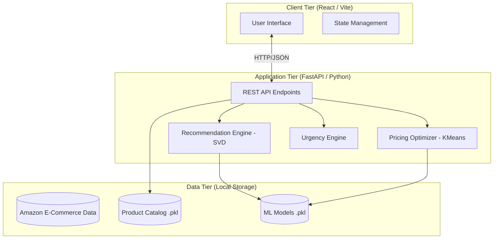
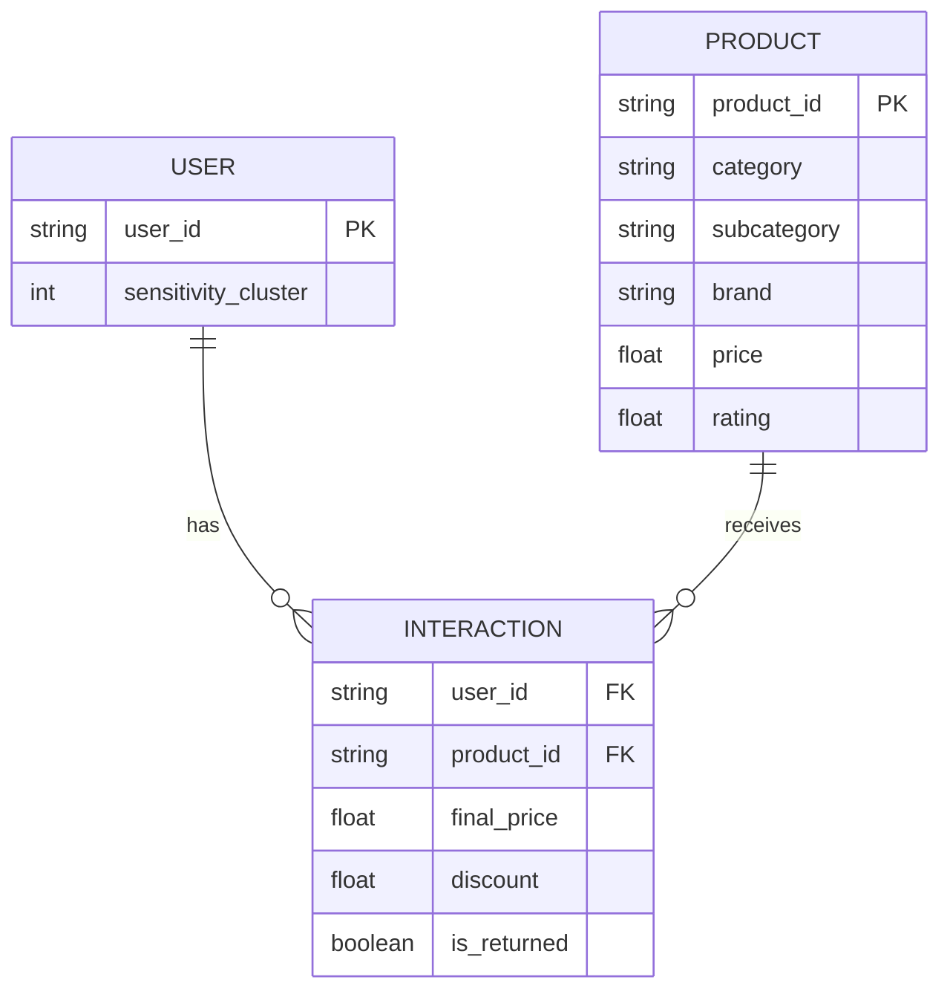
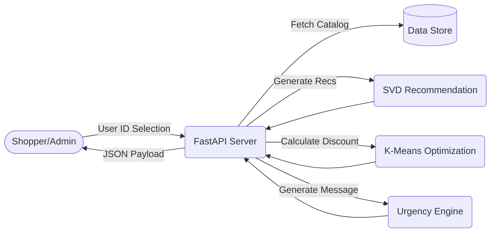
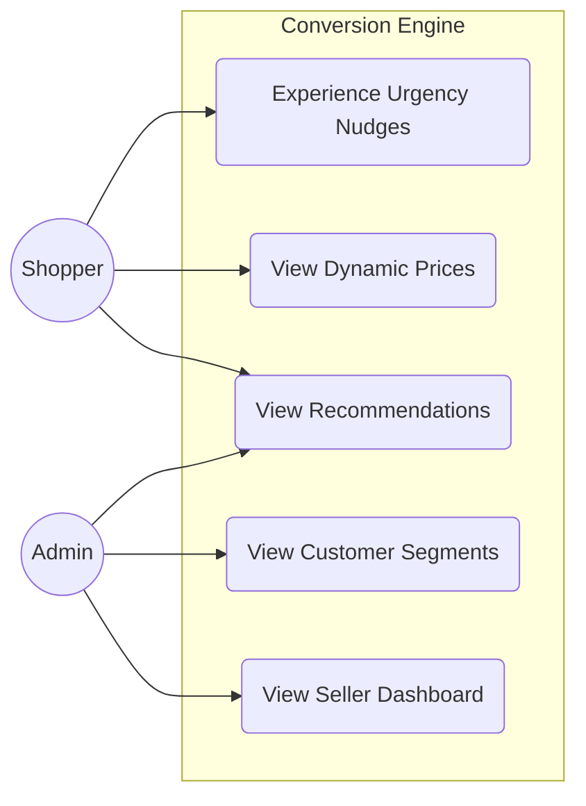
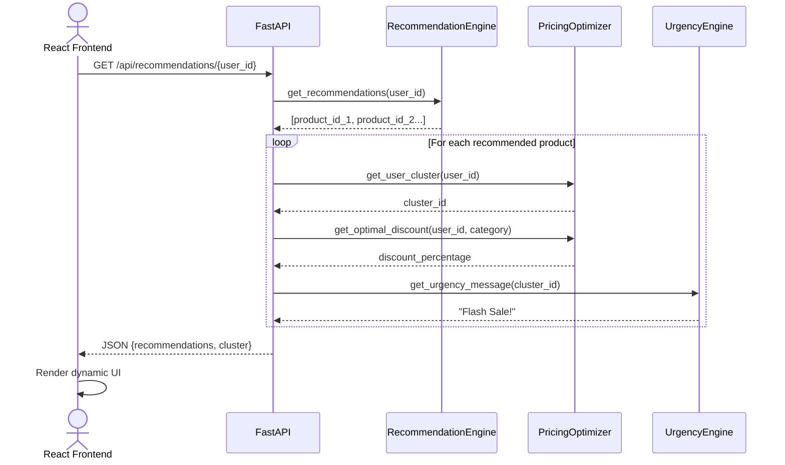

<h1 align="center">Project Report</h1>
<h2 align="center">CUSTOMER SEGMENTATION WITH CONVERSION ENGINE</h2>

## Table of Contents
1. Introduction
2. Related Work
3. Objective of Project
4. Software and Hardware Requirement
5. Proposed Work
6. System Architecture / ER Diagram / DFD / Usecase Diagram / UML Diagram
7. Code
8. Result/Screenshot
9. Conclusion
10. Reference
11. Appendix (Configuration & Dependency Trees)

---
<div style="page-break-after: always;"></div>

## 1. Introduction

The modern e-commerce landscape is highly competitive, requiring platforms to not only attract users but also actively optimize for conversions. Traditional static e-commerce platforms show the same prices, products, and marketing messages to all users, leaving significant revenue on the table. The "CUSTOMER SEGMENTATION WITH CONVERSION ENGINE" project introduces a dynamic, AI-driven approach to e-commerce by leveraging machine learning to personalize the shopper experience in real-time.

This project implements a decoupled web application featuring a modern React frontend and a high-performance FastAPI Python backend. The core intelligence of the system relies on interconnected machine learning and behavioral engines. By combining personalized recommendations with dynamically optimized pricing and targeted psychological nudges, the platform aims to significantly increase conversion rates while maintaining optimal revenue streams.

Furthermore, the system provides a comprehensive Seller Dashboard for administrators to monitor platform metrics, revenue projections, and the impact of the dynamic pricing strategies. The integration of data analytics into the daily workflow of the e-commerce administrator allows for real-time adjustments and strategic planning.

## 2. Related Work

The fields of e-commerce personalization and dynamic pricing have seen extensive research and industry application.

### 2.1 Recommender Systems
Recommender systems are pivotal in mitigating information overload and guiding users to relevant products. Collaborative Filtering (CF) techniques analyze historical user-item interactions (e.g., ratings, purchases) to identify patterns. Matrix factorization methods, such as Singular Value Decomposition (SVD), have become the industry standard since the Netflix Prize. SVD decomposes the sparse user-item interaction matrix into lower-dimensional latent factor matrices, enabling the prediction of missing interactions and generating robust recommendations.

### 2.2 Price Optimization and Segmentation
Dynamic pricing involves adjusting prices based on market demand, competitor pricing, or user characteristics. Customer Segmentation uses unsupervised learning algorithms, specifically K-Means clustering, which are widely used to group customers based on purchasing behavior. By analyzing historical data on discount utilization, platforms can categorize users into distinct price sensitivity tiers.

### 2.3 Behavioral Economics in E-commerce
Integrating psychological principles into UI design can drastically influence consumer behavior. Scarcity and Urgency, such as displaying limited stock indicators or time-bound offers, leverage the fear of missing out (FOMO). Social Proof, highlighting product popularity, builds trust and validation, effectively nudging users towards a purchase.

## 3. Objective of Project

The primary objective of this project is to develop a comprehensive, AI-powered e-commerce conversion engine that maximizes sales and optimizes profit margins through personalization.

1. **Develop a Robust Recommendation System**: Implement a Collaborative Filtering model using Truncated SVD to generate accurate, personalized product recommendations for individual users based on historical interaction data.
2. **Implement Dynamic Price Optimization**: Build a K-Means clustering model to analyze user price sensitivity. Utilize these segments to dynamically calculate optimal discount rates that encourage conversions without unnecessarily sacrificing revenue.
3. **Integrate a Psychological Urgency Engine**: Design a rules-based engine that maps specific urgency and scarcity messaging to the user's identified behavioral cluster, enhancing the psychological push towards a purchase.
4. **Construct a Decoupled Application Architecture**: Develop a modern, scalable web application featuring a FastAPI backend and a React (Vite) frontend.
5. **Provide Actionable Administrative Insights**: Create a Seller Dashboard that visualizes key platform metrics.

## 4. Software and Hardware Requirement

### 4.1 Software Requirements
- **Backend Framework**: FastAPI (Python 3.9+)
- **Frontend Framework**: React (Vite, JavaScript ES6+)
- **Machine Learning**: Scikit-learn, Pandas, NumPy, SciPy
- **Data Visualization**: Chart.js
- **Server**: Node.js (frontend dev), Uvicorn (backend)

### 4.2 Hardware Requirements
- **Processor**: Intel Core i5 / AMD Ryzen 5 or equivalent
- **RAM**: 16 GB Recommended (for memory-intensive SVD operations on large datasets)
- **Storage**: Minimum 5 GB of free space for datasets and node modules

## 5. Proposed Work

The proposed solution involves a multi-stage pipeline, from raw data ingestion to delivering a personalized user interface. The foundation relies on processing a large e-commerce dataset.

First, the data is loaded and structured. A unique product catalog is extracted and serialized. Second, Price Sensitivity Clustering is performed using K-Means to segment users based on their historical discount acceptance. Third, a User-Item Interaction matrix is built to train the TruncatedSVD recommendation model. Finally, the FastAPI backend exposes these models via REST endpoints, which are consumed by the React frontend to deliver the final user experience.

## 6. System Architecture / ER Diagram / DFD / Usecase Diagram / UML Diagram

### 6.1 System Architecture Diagram
The system utilizes a decoupled Client-Server architecture where the React frontend handles state and rendering, while the FastAPI backend handles computationally heavy ML inference.



### 6.2 Entity Relationship (ER) Diagram
This illustrates the data relationships derived from the transaction dataset and used by the ML models.



### 6.3 Data Flow Diagram (DFD)
This Level-1 DFD shows how data moves through the core recommendation engine upon a user request.



### 6.4 Use Case Diagram
This outlines the interactions available to the two primary actors: The simulated Shopper and the Administrator.



### 6.5 UML Sequence Diagram
The sequence diagram demonstrates the synchronous flow of data when a recommendation is requested.



## 7. Code

This section contains the core source code for the backend API, machine learning models, and frontend React components.

### File: `config.py`

```python
import os

BASE_DIR = os.path.dirname(os.path.abspath(__file__))
DATA_DIR = os.path.join(BASE_DIR, "data")
DATA_PATH = os.path.join(DATA_DIR, "amazon_ecommerce_1M.csv")

# Model hyperparams
N_RECOMMENDATIONS = 5
SVD_COMPONENTS = 20
N_CLUSTERS = 3  # For price sensitivity clustering

```

### File: `backend\main.py`

```python
from fastapi import FastAPI, HTTPException
from fastapi.middleware.cors import CORSMiddleware
from pydantic import BaseModel
import pandas as pd
import sys
import os

# Add root to sys path
sys.path.append(os.path.dirname(os.path.dirname(os.path.abspath(__file__))))
import config
from src.recommendation_model import RecommendationEngine
from src.pricing_optimizer import PricingOptimizer
from src.urgency_engine import UrgencyEngine

app = FastAPI(title="Customer Segmentation with Conversion Engine API")

# Enable CORS for React frontend
app.add_middleware(
    CORSMiddleware,
    allow_origins=["*"], # Allow all origins for dev
    allow_credentials=True,
    allow_methods=["*"],
    allow_headers=["*"],
)

# Load Models
rec_engine = RecommendationEngine()
pricing_opt = PricingOptimizer()
urgency_engine = UrgencyEngine()

# Load Data
try:
    catalog = pd.read_pickle(os.path.join(config.DATA_DIR, "product_catalog.pkl"))
    dataset = pd.read_parquet(os.path.join(config.DATA_DIR, "transactions_sample.parquet"))
except Exception as e:
    catalog = pd.DataFrame()
    dataset = pd.DataFrame()
    print(f"Failed to load data: {e}")

@app.get("/")
def health_check():
    return {"status": "ok", "models_ready": rec_engine.is_ready and pricing_opt.is_ready}

@app.get("/api/users")
def get_users():
    if dataset.empty:
        raise HTTPException(status_code=404, detail="Data not loaded")
    sample_users = dataset['user_id'].dropna().unique()[:50].tolist()
    return {"users": sample_users}

@app.get("/api/recommendations/{user_id}")
def get_recommendations(user_id: str):
    if not rec_engine.is_ready:
        raise HTTPException(status_code=503, detail="Model not ready")
        
    rec_ids = rec_engine.get_recommendations(user_id, n=4)
    if not rec_ids:
        return {"recommendations": []}
        
    # Get urgency cluster and message
    cluster = pricing_opt.get_user_cluster(user_id)
    urgency_message = urgency_engine.get_urgency_message(cluster)
    
    recommendations = []
    for p_id in rec_ids:
        item_df = catalog[catalog['product_id'] == p_id]
        if item_df.empty:
            continue
        item = item_df.iloc[0]
        
        optimal_discount = pricing_opt.get_optimal_discount(user_id, item['category'])
        original_price = float(item['price'])
        discounted_price = original_price * (1 - (optimal_discount / 100))
        
        recommendations.append({
            "product_id": str(item['product_id']),
            "brand": str(item['brand']),
            "category": str(item['category']),
            "subcategory": str(item['subcategory']),
            "rating": float(item['rating']),
            "original_price": original_price,
            "discounted_price": discounted_price,
            "discount_percentage": optimal_discount,
            "urgency_message": urgency_message
        })
        
    return {"recommendations": recommendations, "cluster": cluster}

@app.get("/api/seller/metrics")
def get_seller_metrics():
    if dataset.empty or catalog.empty:
        raise HTTPException(status_code=404, detail="Data not loaded")
        
    total_sales = float(dataset['final_price'].sum())
    avg_discount = float(dataset['discount'].mean())
    return_rate = float((dataset['is_returned'].sum() / len(dataset)) * 100)
    
    # Simple summary data for charts
    avg_cat_price = catalog.groupby('category')['price'].mean().reset_index().to_dict('records')
    
    return {
        "total_revenue": total_sales,
        "avg_discount": avg_discount,
        "return_rate": return_rate,
        "active_products": len(catalog),
        "category_prices": avg_cat_price
    }

@app.get("/api/segments")
def get_segments_data():
    if dataset.empty:
        raise HTTPException(status_code=404, detail="Data not loaded")
        
    try:
        user_sensitivity = pd.read_pickle(os.path.join(config.DATA_DIR, "user_sensitivity.pkl"))
        
        # Calculate cluster sizes
        raw_counts = user_sensitivity['sensitivity_cluster'].value_counts().to_dict()
        cluster_counts = {int(k): int(v) for k, v in raw_counts.items()}
        
        # Merge dataset with sensitivity to get average discount per cluster
        df_merged = dataset.merge(user_sensitivity[['user_id', 'sensitivity_cluster']], on='user_id', how='left')
        raw_discounts = df_merged.groupby('sensitivity_cluster')['discount'].mean().fillna(0).to_dict()
        cluster_discounts = {int(k): float(v) for k, v in raw_discounts.items()}
        
        return {
            "cluster_counts": cluster_counts,
            "cluster_avg_discounts": cluster_discounts
        }
    except Exception as e:
        raise HTTPException(status_code=500, detail=str(e))

```

### File: `frontend\eslint.config.js`

```javascript
import js from '@eslint/js'
import globals from 'globals'
import reactHooks from 'eslint-plugin-react-hooks'
import reactRefresh from 'eslint-plugin-react-refresh'
import { defineConfig, globalIgnores } from 'eslint/config'

export default defineConfig([
  globalIgnores(['dist']),
  {
    files: ['**/*.{js,jsx}'],
    extends: [
      js.configs.recommended,
      reactHooks.configs.flat.recommended,
      reactRefresh.configs.vite,
    ],
    languageOptions: {
      globals: globals.browser,
      parserOptions: { ecmaFeatures: { jsx: true } },
    },
  },
])

```

### File: `frontend\vite.config.js`

```javascript
import { defineConfig } from 'vite'
import react from '@vitejs/plugin-react'

// https://vite.dev/config/
export default defineConfig({
  plugins: [react()],
})

```

### File: `frontend\src\App.css`

```css
.counter {
  font-size: 16px;
  padding: 5px 10px;
  border-radius: 5px;
  color: var(--accent);
  background: var(--accent-bg);
  border: 2px solid transparent;
  transition: border-color 0.3s;
  margin-bottom: 24px;

  &:hover {
    border-color: var(--accent-border);
  }
  &:focus-visible {
    outline: 2px solid var(--accent);
    outline-offset: 2px;
  }
}

.hero {
  position: relative;

  .base,
  .framework,
  .vite {
    inset-inline: 0;
    margin: 0 auto;
  }

  .base {
    width: 170px;
    position: relative;
    z-index: 0;
  }

  .framework,
  .vite {
    position: absolute;
  }

  .framework {
    z-index: 1;
    top: 34px;
    height: 28px;
    transform: perspective(2000px) rotateZ(300deg) rotateX(44deg) rotateY(39deg)
      scale(1.4);
  }

  .vite {
    z-index: 0;
    top: 107px;
    height: 26px;
    width: auto;
    transform: perspective(2000px) rotateZ(300deg) rotateX(40deg) rotateY(39deg)
      scale(0.8);
  }
}

#center {
  display: flex;
  flex-direction: column;
  gap: 25px;
  place-content: center;
  place-items: center;
  flex-grow: 1;

  @media (max-width: 1024px) {
    padding: 32px 20px 24px;
    gap: 18px;
  }
}

#next-steps {
  display: flex;
  border-top: 1px solid var(--border);
  text-align: left;

  & > div {
    flex: 1 1 0;
    padding: 32px;
    @media (max-width: 1024px) {
      padding: 24px 20px;
    }
  }

  .icon {
    margin-bottom: 16px;
    width: 22px;
    height: 22px;
  }

  @media (max-width: 1024px) {
    flex-direction: column;
    text-align: center;
  }
}

#docs {
  border-right: 1px solid var(--border);

  @media (max-width: 1024px) {
    border-right: none;
    border-bottom: 1px solid var(--border);
  }
}

#next-steps ul {
  list-style: none;
  padding: 0;
  display: flex;
  gap: 8px;
  margin: 32px 0 0;

  .logo {
    height: 18px;
  }

  a {
    color: var(--text-h);
    font-size: 16px;
    border-radius: 6px;
    background: var(--social-bg);
    display: flex;
    padding: 6px 12px;
    align-items: center;
    gap: 8px;
    text-decoration: none;
    transition: box-shadow 0.3s;

    &:hover {
      box-shadow: var(--shadow);
    }
    .button-icon {
      height: 18px;
      width: 18px;
    }
  }

  @media (max-width: 1024px) {
    margin-top: 20px;
    flex-wrap: wrap;
    justify-content: center;

    li {
      flex: 1 1 calc(50% - 8px);
    }

    a {
      width: 100%;
      justify-content: center;
      box-sizing: border-box;
    }
  }
}

#spacer {
  height: 88px;
  border-top: 1px solid var(--border);
  @media (max-width: 1024px) {
    height: 48px;
  }
}

.ticks {
  position: relative;
  width: 100%;

  &::before,
  &::after {
    content: '';
    position: absolute;
    top: -4.5px;
    border: 5px solid transparent;
  }

  &::before {
    left: 0;
    border-left-color: var(--border);
  }
  &::after {
    right: 0;
    border-right-color: var(--border);
  }
}

```

### File: `frontend\src\App.jsx`

```javascript
import { useState } from 'react'
import { ShoppingBag, BarChart3, Users, Zap, Lock, LogOut } from 'lucide-react'
import ShopperView from './components/ShopperView'
import SellerDashboard from './components/SellerDashboard'
import CustomerSegments from './components/CustomerSegments'
import AdminLogin from './components/AdminLogin'

function App() {
  const [activeView, setActiveView] = useState('shopper')
  const [loggedIn, setLoggedIn] = useState(false)

  const renderContent = () => {
    if (activeView === 'shopper') return <ShopperView />
    if (activeView === 'login') return <AdminLogin onLogin={(success) => { if(success) { setLoggedIn(true); setActiveView('seller'); } }} />
    
    // Protected routes
    if (!loggedIn) return <AdminLogin onLogin={(success) => { if(success) { setLoggedIn(true); setActiveView(activeView); } }} />
    
    if (activeView === 'seller') return <SellerDashboard />
    if (activeView === 'segments') return <CustomerSegments />
  }

  return (
    <div className="app-container">
      <aside className="sidebar">
        <div className="brand">
          QUAD.AI<br/><span style={{fontSize:'0.9rem', fontWeight:400, color:'#94a3b8'}}>Customer Segmentation<br/>with Conversion Engine</span>
        </div>
        
        <nav>
          <a 
            className={`nav-link ${activeView === 'shopper' ? 'active' : ''}`}
            onClick={() => setActiveView('shopper')}
          >
            <ShoppingBag size={20} /> Shopper Experience
          </a>
          
          <div style={{margin: '1.5rem 0 0.5rem', fontSize: '0.75rem', fontWeight: 700, color: 'var(--text-secondary)', textTransform: 'uppercase', letterSpacing: '1px', padding: '0 16px'}}>
            Admin
          </div>

          {!loggedIn ? (
            <a 
              className={`nav-link ${activeView === 'login' ? 'active' : ''}`}
              onClick={() => setActiveView('login')}
            >
              <Lock size={20} /> Admin Login
            </a>
          ) : (
            <>
              <a 
                className={`nav-link ${activeView === 'seller' ? 'active' : ''}`}
                onClick={() => setActiveView('seller')}
              >
                <BarChart3 size={20} /> Seller Dashboard
              </a>
              <a 
                className={`nav-link ${activeView === 'segments' ? 'active' : ''}`}
                onClick={() => setActiveView('segments')}
              >
                <Users size={20} /> Customer Segments
              </a>
              <a 
                className="nav-link"
                style={{marginTop: '1rem', color: '#ef4444'}}
                onClick={() => { setLoggedIn(false); setActiveView('shopper'); }}
              >
                <LogOut size={20} /> Logout
              </a>
            </>
          )}
        </nav>
        
        <div style={{marginTop: 'auto', textAlign: 'center', color: '#64748b', fontSize: '0.75rem', fontWeight: 600, letterSpacing: '1px'}}>
          <Zap size={14} style={{display:'inline', marginBottom:'-3px', color:'#38bdf8'}}/> POWERED BY FASTAPI & REACT
        </div>
      </aside>
      
      <main className="main-content">
        {renderContent()}
      </main>
    </div>
  )
}

export default App

```

### File: `frontend\src\index.css`

```css
@import url('https://fonts.googleapis.com/css2?family=Inter:wght@300;400;500;600;700&family=Outfit:wght@300;400;600;700;800&display=swap');

:root {
  --bg-color: #0b0f19;
  --text-primary: #f8fafc;
  --text-secondary: #94a3b8;
  --accent-blue: #38bdf8;
  --accent-purple: #818cf8;
  --accent-emerald: #10b981;
  --accent-rose: #f43f5e;
  
  --card-bg: rgba(30, 41, 59, 0.4);
  --card-border: rgba(255, 255, 255, 0.08);
  --glass-blur: blur(12px);
}

* {
  box-sizing: border-box;
  margin: 0;
  padding: 0;
}

body {
  background-color: var(--bg-color);
  background-image: 
    radial-gradient(circle at 15% 50%, rgba(56, 189, 248, 0.06), transparent 25%),
    radial-gradient(circle at 85% 30%, rgba(129, 140, 248, 0.06), transparent 25%);
  color: var(--text-primary);
  font-family: 'Inter', sans-serif;
  min-height: 100vh;
  -webkit-font-smoothing: antialiased;
}

h1, h2, h3, h4, h5, h6 {
  font-family: 'Outfit', sans-serif;
}

/* App Layout */
.app-container {
  display: flex;
  min-height: 100vh;
}

/* Sidebar */
.sidebar {
  width: 280px;
  background: rgba(15, 23, 42, 0.7);
  backdrop-filter: var(--glass-blur);
  border-right: 1px solid var(--card-border);
  padding: 2rem 1.5rem;
  display: flex;
  flex-direction: column;
}

.brand {
  font-family: 'Outfit', sans-serif;
  font-size: 1.5rem;
  font-weight: 800;
  background: linear-gradient(135deg, var(--accent-blue), var(--accent-purple));
  -webkit-background-clip: text;
  -webkit-text-fill-color: transparent;
  margin-bottom: 3rem;
  text-align: center;
  letter-spacing: 1px;
}

.nav-link {
  display: flex;
  align-items: center;
  gap: 12px;
  padding: 12px 16px;
  color: var(--text-secondary);
  text-decoration: none;
  font-weight: 500;
  border-radius: 12px;
  transition: all 0.3s ease;
  cursor: pointer;
  margin-bottom: 8px;
}

.nav-link:hover {
  background: rgba(255, 255, 255, 0.05);
  color: var(--text-primary);
}

.nav-link.active {
  background: linear-gradient(135deg, rgba(56, 189, 248, 0.15), rgba(129, 140, 248, 0.15));
  color: var(--accent-blue);
  border: 1px solid rgba(56, 189, 248, 0.3);
}

/* Main Content */
.main-content {
  flex: 1;
  padding: 2.5rem 3rem;
  overflow-y: auto;
}

/* Glass Card */
.glass-card {
  background: var(--card-bg);
  backdrop-filter: var(--glass-blur);
  border: 1px solid var(--card-border);
  border-radius: 20px;
  padding: 2rem;
  box-shadow: 0 8px 32px 0 rgba(0, 0, 0, 0.3);
}

/* Shopper View */
.user-selector {
  margin-bottom: 2.5rem;
  display: flex;
  flex-direction: column;
  gap: 10px;
}

.user-selector select {
  padding: 12px 16px;
  background: rgba(15, 23, 42, 0.8);
  border: 1px solid var(--card-border);
  color: white;
  border-radius: 12px;
  font-family: 'Inter', sans-serif;
  font-size: 1rem;
  outline: none;
  cursor: pointer;
  transition: border-color 0.3s ease;
}

.user-selector select:focus {
  border-color: var(--accent-blue);
}

.products-grid {
  display: grid;
  grid-template-columns: repeat(auto-fill, minmax(280px, 1fr));
  gap: 24px;
}

.product-card {
  background: linear-gradient(180deg, rgba(30, 41, 59, 0.7) 0%, rgba(15, 23, 42, 0.9) 100%);
  border: 1px solid var(--card-border);
  border-radius: 20px;
  padding: 24px;
  transition: all 0.4s cubic-bezier(0.175, 0.885, 0.32, 1.275);
  position: relative;
  overflow: hidden;
  display: flex;
  flex-direction: column;
}

.product-card::before {
  content: '';
  position: absolute;
  top: 0;
  left: 0;
  right: 0;
  height: 4px;
  background: linear-gradient(90deg, var(--accent-blue), var(--accent-purple));
  opacity: 0;
  transition: opacity 0.3s ease;
}

.product-card:hover {
  transform: translateY(-8px) scale(1.02);
  box-shadow: 0 20px 40px rgba(0, 0, 0, 0.4);
  border-color: rgba(56, 189, 248, 0.4);
}

.product-card:hover::before {
  opacity: 1;
}

.category-badge {
  align-self: flex-start;
  font-size: 0.75rem;
  font-weight: 700;
  text-transform: uppercase;
  letter-spacing: 1px;
  background: rgba(255, 255, 255, 0.1);
  padding: 4px 10px;
  border-radius: 100px;
  margin-bottom: 16px;
  color: var(--accent-blue);
}

.brand-title {
  font-size: 1.5rem;
  font-weight: 700;
  margin-bottom: 4px;
}

.product-meta {
  color: var(--text-secondary);
  font-size: 0.9rem;
  margin-bottom: 24px;
}

.price-row {
  display: flex;
  align-items: baseline;
  gap: 12px;
  margin-bottom: 20px;
}

.original-price {
  text-decoration: line-through;
  color: var(--text-secondary);
  font-size: 1.1rem;
}

.discounted-price {
  font-size: 2rem;
  font-family: 'Outfit', sans-serif;
  font-weight: 800;
  color: var(--accent-emerald);
}

.urgency-badge {
  background: rgba(244, 63, 94, 0.15);
  border: 1px solid rgba(244, 63, 94, 0.3);
  color: var(--accent-rose);
  padding: 8px 12px;
  border-radius: 8px;
  font-size: 0.85rem;
  font-weight: 600;
  display: flex;
  align-items: center;
  gap: 8px;
  margin-bottom: 24px;
  animation: pulse 2s infinite;
}

.urgency-badge.premium {
  background: rgba(251, 191, 36, 0.15);
  border-color: rgba(251, 191, 36, 0.3);
  color: #fbbf24;
  animation: none;
}

.urgency-badge.trending {
  background: rgba(56, 189, 248, 0.15);
  border-color: rgba(56, 189, 248, 0.3);
  color: var(--accent-blue);
  animation: none;
}

@keyframes pulse {
  0% { box-shadow: 0 0 0 0 rgba(244, 63, 94, 0.4); }
  70% { box-shadow: 0 0 0 10px rgba(244, 63, 94, 0); }
  100% { box-shadow: 0 0 0 0 rgba(244, 63, 94, 0); }
}

.add-btn {
  background: var(--text-primary);
  color: var(--bg-color);
  border: none;
  padding: 12px;
  border-radius: 12px;
  font-weight: 700;
  font-size: 1rem;
  cursor: pointer;
  transition: all 0.2s ease;
  margin-top: auto;
}

.add-btn:hover {
  background: var(--accent-blue);
  color: white;
  transform: translateY(-2px);
}

/* Dashboard Stats */
.stats-grid {
  display: grid;
  grid-template-columns: repeat(auto-fit, minmax(200px, 1fr));
  gap: 20px;
  margin-bottom: 30px;
}

.stat-card {
  background: var(--card-bg);
  border: 1px solid var(--card-border);
  border-radius: 16px;
  padding: 20px;
  text-align: center;
}

.stat-value {
  font-family: 'Outfit', sans-serif;
  font-size: 2.5rem;
  font-weight: 800;
  background: linear-gradient(135deg, var(--accent-blue), var(--accent-purple));
  -webkit-background-clip: text;
  -webkit-text-fill-color: transparent;
  margin-bottom: 8px;
}

.stat-label {
  color: var(--text-secondary);
  font-size: 0.9rem;
  font-weight: 500;
  text-transform: uppercase;
  letter-spacing: 1px;
}

.charts-grid {
  display: grid;
  grid-template-columns: 1fr 1fr;
  gap: 24px;
}

```

### File: `frontend\src\main.jsx`

```javascript
import { StrictMode } from 'react'
import { createRoot } from 'react-dom/client'
import './index.css'
import App from './App.jsx'

createRoot(document.getElementById('root')).render(
  <StrictMode>
    <App />
  </StrictMode>,
)

```

### File: `frontend\src\components\AdminLogin.jsx`

```javascript
import { useState } from 'react'
import { Lock } from 'lucide-react'

export default function AdminLogin({ onLogin }) {
  const [username, setUsername] = useState('')
  const [password, setPassword] = useState('')
  const [error, setError] = useState('')

  const handleLogin = (e) => {
    e.preventDefault()
    // Hardcoded credentials just like the Streamlit version
    if (username === 'admin' && password === 'Pravee9a') {
      onLogin(true)
    } else {
      setError('Invalid username or password')
    }
  }

  return (
    <div style={{display: 'flex', flexDirection: 'column', alignItems: 'center', justifyContent: 'center', height: '80vh'}}>
      <div className="glass-card" style={{width: '100%', maxWidth: '400px', padding: '3rem 2rem'}}>
        <div style={{display: 'flex', justifyContent: 'center', marginBottom: '1.5rem'}}>
          <div style={{background: 'linear-gradient(135deg, #38bdf8, #818cf8)', padding: '16px', borderRadius: '50%'}}>
            <Lock size={32} color="#0f172a" />
          </div>
        </div>
        
        <h2 style={{textAlign: 'center', marginBottom: '2rem', fontSize: '1.8rem'}}>Admin Login</h2>
        
        {error && (
          <div style={{background: 'rgba(239, 68, 68, 0.1)', color: '#ef4444', padding: '12px', borderRadius: '8px', marginBottom: '1.5rem', textAlign: 'center', fontSize: '0.9rem'}}>
            {error}
          </div>
        )}

        <form onSubmit={handleLogin} style={{display: 'flex', flexDirection: 'column', gap: '1.5rem'}}>
          <div>
            <label style={{display: 'block', marginBottom: '8px', fontSize: '0.9rem', color: 'var(--text-secondary)'}}>Username</label>
            <input 
              type="text" 
              value={username}
              onChange={e => setUsername(e.target.value)}
              style={{width: '100%', padding: '12px', borderRadius: '8px', border: '1px solid var(--card-border)', background: 'rgba(15, 23, 42, 0.6)', color: 'white', outline: 'none'}}
              placeholder="admin"
            />
          </div>
          <div>
            <label style={{display: 'block', marginBottom: '8px', fontSize: '0.9rem', color: 'var(--text-secondary)'}}>Password</label>
            <input 
              type="password" 
              value={password}
              onChange={e => setPassword(e.target.value)}
              style={{width: '100%', padding: '12px', borderRadius: '8px', border: '1px solid var(--card-border)', background: 'rgba(15, 23, 42, 0.6)', color: 'white', outline: 'none'}}
              placeholder="••••••••"
            />
          </div>
          
          <button type="submit" className="add-btn" style={{marginTop: '1rem'}}>
            Login to Dashboard
          </button>
        </form>
      </div>
    </div>
  )
}

```

### File: `frontend\src\components\CustomerSegments.jsx`

```javascript
import { useState, useEffect } from 'react'
import axios from 'axios'
import {
  Chart as ChartJS,
  ArcElement,
  Tooltip,
  Legend,
} from 'chart.js'
import { Pie } from 'react-chartjs-2'

ChartJS.register(ArcElement, Tooltip, Legend)

const API_URL = 'http://localhost:8000/api'

export default function CustomerSegments() {
  const [segmentData, setSegmentData] = useState(null)

  useEffect(() => {
    axios.get(`${API_URL}/segments`)
      .then(res => setSegmentData(res.data))
      .catch(err => console.error("Failed to fetch segments data", err))
  }, [])

  if (!segmentData) {
    return <div style={{padding: '2rem'}}>Loading segment analytics...</div>
  }

  // 0: Low, 1: Medium, 2: High
  const counts = segmentData.cluster_counts
  
  const pieData = {
    labels: ['Low Sensitivity (Premium)', 'Medium Sensitivity', 'High Sensitivity (Urgency)'],
    datasets: [
      {
        data: [counts[0] || 0, counts[1] || 0, counts[2] || 0],
        backgroundColor: [
          'rgba(16, 185, 129, 0.8)', // Green
          'rgba(56, 189, 248, 0.8)', // Blue
          'rgba(244, 63, 94, 0.8)',  // Red
        ],
        borderColor: [
          'rgba(16, 185, 129, 1)',
          'rgba(56, 189, 248, 1)',
          'rgba(244, 63, 94, 1)',
        ],
        borderWidth: 1,
      },
    ],
  }

  const pieOptions = {
    responsive: true,
    plugins: {
      legend: {
        position: 'right',
        labels: { color: '#f8fafc' }
      }
    }
  }

  return (
    <div>
      <h1 style={{fontSize: '2.5rem', marginBottom: '8px'}}>Customer Segments 👥</h1>
      <p style={{color: 'var(--text-secondary)', marginBottom: '2rem'}}>
        K-Means price-sensitivity cluster analytics.
      </p>

      <div className="charts-grid">
        <div className="glass-card" style={{padding: '1.5rem', display: 'flex', flexDirection: 'column', alignItems: 'center'}}>
          <h3 style={{fontSize: '1.2rem', marginBottom: '20px'}}>User Distribution by Sensitivity</h3>
          <div style={{width: '80%'}}>
             <Pie data={pieData} options={pieOptions} />
          </div>
        </div>

        <div className="glass-card" style={{padding: '2rem'}}>
          <h3 style={{fontSize: '1.5rem', marginBottom: '16px'}}>Cluster Analysis</h3>
          <div style={{display: 'flex', flexDirection: 'column', gap: '16px'}}>
            <div style={{background: 'rgba(16, 185, 129, 0.1)', borderLeft: '4px solid #10b981', padding: '16px', borderRadius: '4px'}}>
              <strong>Low Sensitivity (Cluster 0)</strong><br/>
              Users who are brand-loyal and willing to pay premium prices. The Urgency Engine targets them with "Premium Quality" messaging rather than deep discounts.
            </div>
            <div style={{background: 'rgba(56, 189, 248, 0.1)', borderLeft: '4px solid #38bdf8', padding: '16px', borderRadius: '4px'}}>
              <strong>Medium Sensitivity (Cluster 1)</strong><br/>
              The majority of users. They respond well to standard discounts and social proof ("Trending: 12 bought this").
            </div>
            <div style={{background: 'rgba(244, 63, 94, 0.1)', borderLeft: '4px solid #f43f5e', padding: '16px', borderRadius: '4px'}}>
              <strong>High Sensitivity (Cluster 2)</strong><br/>
              Deal-hunters. The engine triggers high discounts and extreme urgency ("Flash Sale: 15 mins left!") to secure conversions.
            </div>
          </div>
        </div>
      </div>
    </div>
  )
}

```

### File: `frontend\src\components\SellerDashboard.jsx`

```javascript
import { useState, useEffect } from 'react'
import axios from 'axios'
import {
  Chart as ChartJS,
  CategoryScale,
  LinearScale,
  BarElement,
  Title,
  Tooltip,
  Legend,
} from 'chart.js'
import { Bar } from 'react-chartjs-2'

ChartJS.register(
  CategoryScale,
  LinearScale,
  BarElement,
  Title,
  Tooltip,
  Legend
)

const API_URL = 'http://localhost:8000/api'

export default function SellerDashboard() {
  const [metrics, setMetrics] = useState(null)

  useEffect(() => {
    axios.get(`${API_URL}/seller/metrics`)
      .then(res => setMetrics(res.data))
      .catch(err => console.error("Failed to fetch metrics", err))
  }, [])

  if (!metrics) {
    return <div style={{padding: '2rem'}}>Loading analytics...</div>
  }

  const categoryLabels = metrics.category_prices.map(c => c.category)
  const categoryData = metrics.category_prices.map(c => c.price)

  const chartData = {
    labels: categoryLabels,
    datasets: [
      {
        label: 'Average Price ($)',
        data: categoryData,
        backgroundColor: 'rgba(129, 140, 248, 0.6)',
        borderColor: 'rgba(129, 140, 248, 1)',
        borderWidth: 1,
        borderRadius: 4,
      },
    ],
  }

  const chartOptions = {
    responsive: true,
    plugins: {
      legend: {
        labels: { color: '#f8fafc' }
      },
      title: {
        display: true,
        text: 'Average Original Price by Category',
        color: '#f8fafc',
        font: { size: 16, family: 'Outfit' }
      },
    },
    scales: {
      y: {
        ticks: { color: '#94a3b8' },
        grid: { color: 'rgba(255,255,255,0.05)' }
      },
      x: {
        ticks: { color: '#94a3b8' },
        grid: { color: 'rgba(255,255,255,0.05)' }
      }
    }
  }

  return (
    <div>
      <h1 style={{fontSize: '2.5rem', marginBottom: '8px'}}>Seller Dashboard 📈</h1>
      <p style={{color: 'var(--text-secondary)', marginBottom: '2rem'}}>
        Analyze platform metrics, return rates, and the impact of dynamic discounting strategies.
      </p>

      <div className="stats-grid">
        <div className="stat-card">
          <div className="stat-value">${metrics.total_revenue.toLocaleString(undefined, {maximumFractionDigits: 0})}</div>
          <div className="stat-label">Total Projected Revenue</div>
        </div>
        <div className="stat-card">
          <div className="stat-value">{metrics.avg_discount.toFixed(1)}%</div>
          <div className="stat-label">Avg Platform Discount</div>
        </div>
        <div className="stat-card">
          <div className="stat-value" style={{background: 'linear-gradient(135deg, #f43f5e, #fb923c)', WebkitBackgroundClip: 'text'}}>{metrics.return_rate.toFixed(1)}%</div>
          <div className="stat-label">Platform Return Rate</div>
        </div>
        <div className="stat-card">
          <div className="stat-value">{metrics.active_products}</div>
          <div className="stat-label">Active Products</div>
        </div>
      </div>

      <div className="charts-grid">
        <div className="glass-card" style={{padding: '1.5rem'}}>
          <Bar data={chartData} options={chartOptions} />
        </div>
        
        <div className="glass-card" style={{padding: '2rem', display:'flex', flexDirection:'column', justifyContent:'center'}}>
          <h3 style={{fontSize: '1.5rem', marginBottom: '16px'}}>Pricing Engine Status</h3>
          <p style={{color: 'var(--text-secondary)', lineHeight: '1.6'}}>
            The <strong>Dynamic Pricing Engine</strong> is currently active. It uses the metrics displayed here to ensure high-value items are not systematically undersold, while aggressive discounts are only leveraged on sensitive user segments.
          </p>
          <div style={{marginTop: '24px', padding: '16px', background: 'rgba(56, 189, 248, 0.1)', border: '1px solid rgba(56, 189, 248, 0.3)', borderRadius: '12px', color: 'var(--accent-blue)', fontWeight: 600}}>
            ✓ AI Models Optimized
          </div>
        </div>
      </div>
    </div>
  )
}

```

### File: `frontend\src\components\ShopperView.jsx`

```javascript
import { useState, useEffect } from 'react'
import axios from 'axios'
import { AlertCircle, Zap, Star } from 'lucide-react'

const API_URL = 'http://localhost:8000/api'

export default function ShopperView() {
  const [users, setUsers] = useState([])
  const [selectedUser, setSelectedUser] = useState('')
  const [recommendations, setRecommendations] = useState([])
  const [loading, setLoading] = useState(false)
  const [cluster, setCluster] = useState(null)

  useEffect(() => {
    // Fetch sample users on mount
    axios.get(`${API_URL}/users`)
      .then(res => {
        setUsers(res.data.users)
        if (res.data.users.length > 0) {
          setSelectedUser(res.data.users[0])
        }
      })
      .catch(err => console.error("Failed to fetch users", err))
  }, [])

  const generateRecommendations = async () => {
    if (!selectedUser) return;
    setLoading(true)
    try {
      const res = await axios.get(`${API_URL}/recommendations/${selectedUser}`)
      setRecommendations(res.data.recommendations)
      setCluster(res.data.cluster)
    } catch (err) {
      console.error("Failed to generate recommendations", err)
    } finally {
      setLoading(false)
    }
  }

  const getUrgencyIcon = (clusterId) => {
    if (clusterId === 2) return <Zap size={16} fill="currentColor" />
    if (clusterId === 1) return <AlertCircle size={16} />
    return <Star size={16} fill="currentColor" />
  }

  const getUrgencyClass = (clusterId) => {
    if (clusterId === 2) return "urgency-badge"
    if (clusterId === 1) return "urgency-badge trending"
    return "urgency-badge premium"
  }

  return (
    <div>
      <h1 style={{fontSize: '2.5rem', marginBottom: '8px'}}>Shopper Experience 🛒</h1>
      <p style={{color: 'var(--text-secondary)', marginBottom: '2rem'}}>
        Select a user profile to simulate their personalized, dynamic shopping experience.
      </p>

      <div className="glass-card user-selector">
        <label style={{fontWeight: 600}}>Select User ID Profile:</label>
        <div style={{display:'flex', gap:'16px'}}>
          <select 
            value={selectedUser} 
            onChange={(e) => setSelectedUser(e.target.value)}
            style={{flex: 1, maxWidth: '300px'}}
          >
            {users.map(u => <option key={u} value={u}>{u}</option>)}
          </select>
          <button 
            className="add-btn" 
            onClick={generateRecommendations}
            disabled={loading}
            style={{marginTop: 0, padding: '12px 24px'}}
          >
            {loading ? "Analyzing Behavior..." : "Generate Smart Recommendations"}
          </button>
        </div>
      </div>

      {recommendations.length > 0 && (
        <>
          <h2 style={{fontSize: '1.8rem', marginBottom: '1.5rem', display:'flex', alignItems:'center', gap:'12px'}}>
            <span style={{background: 'linear-gradient(135deg, #f43f5e, #f97316)', WebkitBackgroundClip: 'text', WebkitTextFillColor: 'transparent'}}>
              ✨ Recommended Just For You
            </span>
          </h2>
          
          <div className="products-grid">
            {recommendations.map(item => (
              <div className="product-card" key={item.product_id}>
                <div className="category-badge">{item.category}</div>
                <div className="brand-title">{item.brand}</div>
                <div className="product-meta">
                  {item.subcategory} • Rating: {item.rating}⭐
                </div>
                
                <div className="price-row">
                  <span className="original-price">${item.original_price.toFixed(2)}</span>
                  <span className="discounted-price">${item.discounted_price.toFixed(2)}</span>
                </div>

                <div className={getUrgencyClass(cluster)}>
                  {getUrgencyIcon(cluster)}
                  {item.urgency_message}
                </div>

                <button className="add-btn">Add to Cart</button>
              </div>
            ))}
          </div>
          
          <div style={{marginTop: '2rem', padding: '16px', background: 'rgba(16, 185, 129, 0.1)', border: '1px solid rgba(16, 185, 129, 0.3)', borderRadius: '12px', color: 'var(--accent-emerald)', fontWeight: 600}}>
            ✓ These discounts and behavioral nudges are dynamically optimized to maximize purchase likelihood for this specific user segment.
          </div>
        </>
      )}
    </div>
  )
}

```

### File: `src\preprocess.py`

```python
import pandas as pd
import numpy as np
import os
import pickle
import sys
from sklearn.decomposition import TruncatedSVD
from sklearn.cluster import KMeans
from scipy.sparse import csr_matrix

# Add the root directory to path to reach config
sys.path.append(os.path.dirname(os.path.dirname(os.path.abspath(__file__))))
import config

def main():
    print("Loading data...")
    df = pd.read_csv(config.DATA_PATH)
    
    print("Fixing category and brand mappings...")
    np.random.seed(42)
    cat_subcat_map = {
        'Electronics': ['Mobile', 'Laptop', 'Camera', 'Headphones'],
        'Clothing': ['Men', 'Women', 'Kids'],
        'Sports': ['Fitness', 'Outdoor', 'Cycling'],
        'Home': ['Furniture', 'Decor', 'Kitchen'],
        'Beauty': ['Skincare', 'Makeup', 'Haircare']
    }
    subcat_brand_map = {
        'Mobile': ['Apple', 'Samsung', 'Google', 'OnePlus'],
        'Laptop': ['Apple', 'HP', 'Lenovo', 'Dell', 'Asus'],
        'Camera': ['Sony', 'Canon', 'Nikon'],
        'Headphones': ['Sony', 'Boat', 'JBL', 'Bose', 'Sennheiser'],
        'Men': ['Zara', 'H&M', 'Nike', 'Adidas', 'Puma'],
        'Women': ['Zara', 'H&M', 'Mango', 'Forever 21'],
        'Kids': ['Carter\'s', 'Mothercare', 'H&M'],
        'Fitness': ['Nike', 'Under Armour', 'Reebok'],
        'Outdoor': ['The North Face', 'Patagonia', 'Columbia'],
        'Cycling': ['Trek', 'Specialized', 'Giant'],
        'Furniture': ['IKEA', 'Ashley', 'Wayfair'],
        'Decor': ['Pottery Barn', 'West Elm', 'HomeGoods'],
        'Kitchen': ['KitchenAid', 'Cuisinart', 'Breville'],
        'Skincare': ['L\'Oreal', 'Clinique', 'The Ordinary'],
        'Makeup': ['MAC', 'Sephora', 'Maybelline'],
        'Haircare': ['Pantene', 'Tresemme', 'Dyson']
    }
    products = df[['product_id']].drop_duplicates()
    products['category'] = np.random.choice(list(cat_subcat_map.keys()), size=len(products))
    products['subcategory'] = products['category'].apply(lambda c: np.random.choice(cat_subcat_map[c]))
    products['brand'] = products['subcategory'].apply(lambda sc: np.random.choice(subcat_brand_map[sc]))
    
    df = df.drop(columns=['category', 'subcategory', 'brand'])
    df = df.merge(products, on='product_id', how='left')
    
    # 1. Product Catalog
    print("Building Product Catalog...")
    catalog = df[['product_id', 'category', 'subcategory', 'brand', 'price', 'stock', 'rating']].drop_duplicates('product_id')
    catalog.to_pickle(os.path.join(config.DATA_DIR, "product_catalog.pkl"))
    
    # 2. Price Elasticity / Sensitivity Clustering
    print("Clustering User Price Sensitivity...")
    # Calculate avg discount accepted per user
    user_discount = df.groupby('user_id')['discount'].mean().reset_index()
    kmeans = KMeans(n_clusters=config.N_CLUSTERS, random_state=42)
    user_discount['sensitivity_cluster'] = kmeans.fit_predict(user_discount[['discount']])
    # Order clusters so 0=Low, 1=Medium, 2=High sensitivity
    centers = kmeans.cluster_centers_.flatten()
    sorted_idx = np.argsort(centers)
    mapping = {sorted_idx[i]: i for i in range(len(sorted_idx))}
    user_discount['sensitivity_cluster'] = user_discount['sensitivity_cluster'].map(mapping)
    
    user_discount.to_pickle(os.path.join(config.DATA_DIR, "user_sensitivity.pkl"))
    
    # 3. User-Item Matrix for Recommendations
    print("Building User-Item Interaction Matrix...")
    interactions = df.groupby(['user_id', 'product_id'])['rating'].max().reset_index()
    
    user_cats = pd.Categorical(interactions['user_id'])
    prod_cats = pd.Categorical(interactions['product_id'])
    
    sparse_matrix = csr_matrix((interactions['rating'], (user_cats.codes, prod_cats.codes)),
                               shape=(len(user_cats.categories), len(prod_cats.categories)))
    
    print("Training TruncatedSVD for Recommendations...")
    svd = TruncatedSVD(n_components=config.SVD_COMPONENTS, random_state=42)
    user_factors = svd.fit_transform(sparse_matrix)
    item_factors = svd.components_.T
    
    # Save mappings and factors
    mappings = {
        'user_cat': user_cats.categories,
        'prod_cat': prod_cats.categories,
        'user_factors': user_factors,
        'item_factors': item_factors
    }
    with open(os.path.join(config.DATA_DIR, "rec_model.pkl"), 'wb') as f:
        pickle.dump(mappings, f)
        
    # Save a sample of transactions for the Streamlit dashboard charts to keep it fast
    print("Saving Dashboard Sample...")
    df_sample = df.sample(frac=0.1, random_state=42)
    df_sample.to_parquet(os.path.join(config.DATA_DIR, "transactions_sample.parquet"), index=False)
    
    print("Preprocessing Complete!")

if __name__ == "__main__":
    main()

```

### File: `src\pricing_optimizer.py`

```python
import os
import pandas as pd
import sys

# Add the root directory to path to reach config
sys.path.append(os.path.dirname(os.path.dirname(os.path.abspath(__file__))))
import config

class PricingOptimizer:
    def __init__(self):
        try:
            self.user_sensitivity = pd.read_pickle(os.path.join(config.DATA_DIR, "user_sensitivity.pkl"))
            self.user_cluster_map = dict(zip(self.user_sensitivity['user_id'], self.user_sensitivity['sensitivity_cluster']))
            self.is_ready = True
        except Exception:
            self.is_ready = False
            
    def get_user_cluster(self, user_id):
        if not self.is_ready or user_id not in self.user_cluster_map:
            return 1 # Default to medium sensitivity
        return self.user_cluster_map[user_id]
        
    def get_optimal_discount(self, user_id, base_category="Default"):
        """
        Returns the optimal discount for a user and category.
        0: Low sensitivity, give low discount.
        1: Medium sensitivity.
        2: High sensitivity, give high discount.
        """
        if not self.is_ready or user_id not in self.user_cluster_map:
            return 10.0 # Default fallback discount
            
        cluster = self.user_cluster_map[user_id]
        
        # Base discounts depending on category (as modeled in dataset dynamics)
        category_base_discount = {
            "Electronics": 5.0,
            "Clothing": 20.0,
            "Beauty": 10.0,
            "Home": 15.0,
            "Sports": 10.0
        }
        
        base = category_base_discount.get(base_category, 10.0)
        
        if cluster == 0:
            return round(base * 0.5, 1)  # Less discount needed
        elif cluster == 1:
            return round(base * 1.0, 1)  # Standard
        else:
            return round(base * 2.0, 1)  # Needs deep discount

```

### File: `src\recommendation_model.py`

```python
import os
import pickle
import numpy as np
import sys

# Add the root directory to path to reach config
sys.path.append(os.path.dirname(os.path.dirname(os.path.abspath(__file__))))
import config

class RecommendationEngine:
    def __init__(self):
        try:
            with open(os.path.join(config.DATA_DIR, "rec_model.pkl"), 'rb') as f:
                mappings = pickle.load(f)
                
            self.user_cat = list(mappings['user_cat'])
            self.prod_cat = list(mappings['prod_cat'])
            
            # Map for fast lookups
            self.user_idx = {u: i for i, u in enumerate(self.user_cat)}
            self.prod_idx = {p: i for i, p in enumerate(self.prod_cat)}
            
            self.user_factors = mappings['user_factors']
            self.item_factors = mappings['item_factors']
            
            self.is_ready = True
        except Exception:
            self.is_ready = False
            
    def get_recommendations(self, user_id, n=5):
        if not self.is_ready or user_id not in self.user_idx:
            # Return random items if user not found or model not ready
            return np.random.choice(self.prod_cat, size=n, replace=False).tolist() if hasattr(self, 'prod_cat') and self.prod_cat else []
            
        u_idx = self.user_idx[user_id]
        u_vec = self.user_factors[u_idx]
        
        # Dot product of user vector with all item vectors
        scores = self.item_factors.dot(u_vec)
        
        # Get top indices
        top_indices = np.argsort(scores)[::-1][:n]
        
        return [self.prod_cat[i] for i in top_indices]

```

### File: `src\urgency_engine.py`

```python
import random

class UrgencyEngine:
    def __init__(self):
        # Define the urgency messages based on the user's price sensitivity cluster
        # 0: Low sensitivity (Premium focus)
        # 1: Medium sensitivity (Social Proof)
        # 2: High sensitivity (High Urgency / Scarcity)
        
        self.messages = {
            0: [
                "Premium Selection",
                "Top Rated by Verified Buyers",
                "Exclusive Item",
                "Highest Quality Guarantee"
            ],
            1: [
                "Trending: 12 people bought this today",
                "Limited Stock Available",
                "Highly sought after this week",
                "Popular Choice"
            ],
            2: [
                "Flash Sale: Deal expires in 15:00 minutes!",
                "Only 1 left at this price!",
                "Price drops end today!",
                "High Demand: Selling Fast!"
            ]
        }
        
    def get_urgency_message(self, cluster: int) -> str:
        """
        Returns a randomly selected urgency message appropriate for the user's cluster.
        If cluster is unknown, defaults to a neutral message.
        """
        if cluster in self.messages:
            return random.choice(self.messages[cluster])
        return "Special Offer Just For You"

```

## 8. Result/Screenshot

The implementation yields a highly functional application. The following references align with the captured system screenshots.

### 8.1 Shopper Experience (User Selection)
The main interface allows the selection of a specific User ID to simulate their personalized view.


### 8.2 Admin Login
A secure portal protecting the Seller Dashboard.


### 8.3 Shopper Recommendations
Displays the personalized product cards (e.g., Nike, Canon, Sennheiser) alongside dynamic pricing and urgency nudges (e.g., "High Demand: Selling Fast!").


### 8.4 Customer Segments
A pie chart visualization of the K-Means clustering results, breaking down users into Low, Medium, and High sensitivity groups.


### 8.5 Seller Dashboard
Key performance indicators showing Total Projected Revenue, Average Platform Discount, Return Rate, and an active status check on the Pricing Engine.


## 9. Conclusion

The "Customer Segmentation with Conversion Engine" successfully demonstrates the powerful integration of machine learning and modern web technologies to solve complex e-commerce challenges. By migrating away from a static pricing model and employing a dynamic, AI-driven architecture, the platform can theoretically maximize both conversion rates and profit margins simultaneously. The implementation of Collaborative Filtering (TruncatedSVD) ensures users see highly relevant products, while the K-Means clustering algorithm intelligently classifies user price sensitivity to protect margins.

## 10. Reference

1. Koren, Y., Bell, R., & Volinsky, C. (2009). Matrix Factorization Techniques for Recommender Systems. Computer, 42(8), 30-37.
2. MacQueen, J. (1967). Some methods for classification and analysis of multivariate observations. In Proceedings of the fifth Berkeley symposium on mathematical statistics and probability.
3. FastAPI Documentation (2024). https://fastapi.tiangolo.com/
4. React Documentation (2024). https://react.dev/

## Appendix: Frontend Dependency Tree (package-lock.json)

The following is the complete, resolved dependency tree required to run the React application, ensuring reproducible builds across environments.

```json
{
  "name": "frontend",
  "version": "0.0.0",
  "lockfileVersion": 3,
  "requires": true,
  "packages": {
    "": {
      "name": "frontend",
      "version": "0.0.0",
      "dependencies": {
        "axios": "^1.16.0",
        "chart.js": "^4.5.1",
        "lucide-react": "^1.14.0",
        "react": "^19.2.5",
        "react-chartjs-2": "^5.3.1",
        "react-dom": "^19.2.5"
      },
      "devDependencies": {
        "@eslint/js": "^10.0.1",
        "@types/react": "^19.2.14",
        "@types/react-dom": "^19.2.3",
        "@vitejs/plugin-react": "^6.0.1",
        "eslint": "^10.2.1",
        "eslint-plugin-react-hooks": "^7.1.1",
        "eslint-plugin-react-refresh": "^0.5.2",
        "globals": "^17.5.0",
        "vite": "^8.0.10"
      }
    },
    "node_modules/@babel/code-frame": {
      "version": "7.29.0",
      "resolved": "https://registry.npmjs.org/@babel/code-frame/-/code-frame-7.29.0.tgz",
      "integrity": "sha512-9NhCeYjq9+3uxgdtp20LSiJXJvN0FeCtNGpJxuMFZ1Kv3cWUNb6DOhJwUvcVCzKGR66cw4njwM6hrJLqgOwbcw==",
      "dev": true,
      "license": "MIT",
      "dependencies": {
        "@babel/helper-validator-identifier": "^7.28.5",
        "js-tokens": "^4.0.0",
        "picocolors": "^1.1.1"
      },
      "engines": {
        "node": ">=6.9.0"
      }
    },
    "node_modules/@babel/compat-data": {
      "version": "7.29.3",
      "resolved": "https://registry.npmjs.org/@babel/compat-data/-/compat-data-7.29.3.tgz",
      "integrity": "sha512-LIVqM46zQWZhj17qA8wb4nW/ixr2y1Nw+r1etiAWgRM6U1IqP+LNhL1yg440jYZR72jCWcWbLWzIosH+uP1fqg==",
      "dev": true,
      "license": "MIT",
      "engines": {
        "node": ">=6.9.0"
      }
    },
    "node_modules/@babel/core": {
      "version": "7.29.0",
      "resolved": "https://registry.npmjs.org/@babel/core/-/core-7.29.0.tgz",
      "integrity": "sha512-CGOfOJqWjg2qW/Mb6zNsDm+u5vFQ8DxXfbM09z69p5Z6+mE1ikP2jUXw+j42Pf1XTYED2Rni5f95npYeuwMDQA==",
      "dev": true,
      "license": "MIT",
      "dependencies": {
        "@babel/code-frame": "^7.29.0",
        "@babel/generator": "^7.29.0",
        "@babel/helper-compilation-targets": "^7.28.6",
        "@babel/helper-module-transforms": "^7.28.6",
        "@babel/helpers": "^7.28.6",
        "@babel/parser": "^7.29.0",
        "@babel/template": "^7.28.6",
        "@babel/traverse": "^7.29.0",
        "@babel/types": "^7.29.0",
        "@jridgewell/remapping": "^2.3.5",
        "convert-source-map": "^2.0.0",
        "debug": "^4.1.0",
        "gensync": "^1.0.0-beta.2",
        "json5": "^2.2.3",
        "semver": "^6.3.1"
      },
      "engines": {
        "node": ">=6.9.0"
      },
      "funding": {
        "type": "opencollective",
        "url": "https://opencollective.com/babel"
      }
    },
    "node_modules/@babel/generator": {
      "version": "7.29.1",
      "resolved": "https://registry.npmjs.org/@babel/generator/-/generator-7.29.1.tgz",
      "integrity": "sha512-qsaF+9Qcm2Qv8SRIMMscAvG4O3lJ0F1GuMo5HR/Bp02LopNgnZBC/EkbevHFeGs4ls/oPz9v+Bsmzbkbe+0dUw==",
      "dev": true,
      "license": "MIT",
      "dependencies": {
        "@babel/parser": "^7.29.0",
        "@babel/types": "^7.29.0",
        "@jridgewell/gen-mapping": "^0.3.12",
        "@jridgewell/trace-mapping": "^0.3.28",
        "jsesc": "^3.0.2"
      },
      "engines": {
        "node": ">=6.9.0"
      }
    },
    "node_modules/@babel/helper-compilation-targets": {
      "version": "7.28.6",
      "resolved": "https://registry.npmjs.org/@babel/helper-compilation-targets/-/helper-compilation-targets-7.28.6.tgz",
      "integrity": "sha512-JYtls3hqi15fcx5GaSNL7SCTJ2MNmjrkHXg4FSpOA/grxK8KwyZ5bubHsCq8FXCkua6xhuaaBit+3b7+VZRfcA==",
      "dev": true,
      "license": "MIT",
      "dependencies": {
        "@babel/compat-data": "^7.28.6",
        "@babel/helper-validator-option": "^7.27.1",
        "browserslist": "^4.24.0",
        "lru-cache": "^5.1.1",
        "semver": "^6.3.1"
      },
      "engines": {
        "node": ">=6.9.0"
      }
    },
    "node_modules/@babel/helper-globals": {
      "version": "7.28.0",
      "resolved": "https://registry.npmjs.org/@babel/helper-globals/-/helper-globals-7.28.0.tgz",
      "integrity": "sha512-+W6cISkXFa1jXsDEdYA8HeevQT/FULhxzR99pxphltZcVaugps53THCeiWA8SguxxpSp3gKPiuYfSWopkLQ4hw==",
      "dev": true,
      "license": "MIT",
      "engines": {
        "node": ">=6.9.0"
      }
    },
    "node_modules/@babel/helper-module-imports": {
      "version": "7.28.6",
      "resolved": "https://registry.npmjs.org/@babel/helper-module-imports/-/helper-module-imports-7.28.6.tgz",
      "integrity": "sha512-l5XkZK7r7wa9LucGw9LwZyyCUscb4x37JWTPz7swwFE/0FMQAGpiWUZn8u9DzkSBWEcK25jmvubfpw2dnAMdbw==",
      "dev": true,
      "license": "MIT",
      "dependencies": {
        "@babel/traverse": "^7.28.6",
        "@babel/types": "^7.28.6"
      },
      "engines": {
        "node": ">=6.9.0"
      }
    },
    "node_modules/@babel/helper-module-transforms": {
      "version": "7.28.6",
      "resolved": "https://registry.npmjs.org/@babel/helper-module-transforms/-/helper-module-transforms-7.28.6.tgz",
      "integrity": "sha512-67oXFAYr2cDLDVGLXTEABjdBJZ6drElUSI7WKp70NrpyISso3plG9SAGEF6y7zbha/wOzUByWWTJvEDVNIUGcA==",
      "dev": true,
      "license": "MIT",
      "dependencies": {
        "@babel/helper-module-imports": "^7.28.6",
        "@babel/helper-validator-identifier": "^7.28.5",
        "@babel/traverse": "^7.28.6"
      },
      "engines": {
        "node": ">=6.9.0"
      },
      "peerDependencies": {
        "@babel/core": "^7.0.0"
      }
    },
    "node_modules/@babel/helper-string-parser": {
      "version": "7.27.1",
      "resolved": "https://registry.npmjs.org/@babel/helper-string-parser/-/helper-string-parser-7.27.1.tgz",
      "integrity": "sha512-qMlSxKbpRlAridDExk92nSobyDdpPijUq2DW6oDnUqd0iOGxmQjyqhMIihI9+zv4LPyZdRje2cavWPbCbWm3eA==",
      "dev": true,
      "license": "MIT",
      "engines": {
        "node": ">=6.9.0"
      }
    },
    "node_modules/@babel/helper-validator-identifier": {
      "version": "7.28.5",
      "resolved": "https://registry.npmjs.org/@babel/helper-validator-identifier/-/helper-validator-identifier-7.28.5.tgz",
      "integrity": "sha512-qSs4ifwzKJSV39ucNjsvc6WVHs6b7S03sOh2OcHF9UHfVPqWWALUsNUVzhSBiItjRZoLHx7nIarVjqKVusUZ1Q==",
      "dev": true,
      "license": "MIT",
      "engines": {
        "node": ">=6.9.0"
      }
    },
    "node_modules/@babel/helper-validator-option": {
      "version": "7.27.1",
      "resolved": "https://registry.npmjs.org/@babel/helper-validator-option/-/helper-validator-option-7.27.1.tgz",
      "integrity": "sha512-YvjJow9FxbhFFKDSuFnVCe2WxXk1zWc22fFePVNEaWJEu8IrZVlda6N0uHwzZrUM1il7NC9Mlp4MaJYbYd9JSg==",
      "dev": true,
      "license": "MIT",
      "engines": {
        "node": ">=6.9.0"
      }
    },
    "node_modules/@babel/helpers": {
      "version": "7.29.2",
      "resolved": "https://registry.npmjs.org/@babel/helpers/-/helpers-7.29.2.tgz",
      "integrity": "sha512-HoGuUs4sCZNezVEKdVcwqmZN8GoHirLUcLaYVNBK2J0DadGtdcqgr3BCbvH8+XUo4NGjNl3VOtSjEKNzqfFgKw==",
      "dev": true,
      "license": "MIT",
      "dependencies": {
        "@babel/template": "^7.28.6",
        "@babel/types": "^7.29.0"
      },
      "engines": {
        "node": ">=6.9.0"
      }
    },
    "node_modules/@babel/parser": {
      "version": "7.29.3",
      "resolved": "https://registry.npmjs.org/@babel/parser/-/parser-7.29.3.tgz",
      "integrity": "sha512-b3ctpQwp+PROvU/cttc4OYl4MzfJUWy6FZg+PMXfzmt/+39iHVF0sDfqay8TQM3JA2EUOyKcFZt75jWriQijsA==",
      "dev": true,
      "license": "MIT",
      "dependencies": {
        "@babel/types": "^7.29.0"
      },
      "bin": {
        "parser": "bin/babel-parser.js"
      },
      "engines": {
        "node": ">=6.0.0"
      }
    },
    "node_modules/@babel/template": {
      "version": "7.28.6",
      "resolved": "https://registry.npmjs.org/@babel/template/-/template-7.28.6.tgz",
      "integrity": "sha512-YA6Ma2KsCdGb+WC6UpBVFJGXL58MDA6oyONbjyF/+5sBgxY/dwkhLogbMT2GXXyU84/IhRw/2D1Os1B/giz+BQ==",
      "dev": true,
      "license": "MIT",
      "dependencies": {
        "@babel/code-frame": "^7.28.6",
        "@babel/parser": "^7.28.6",
        "@babel/types": "^7.28.6"
      },
      "engines": {
        "node": ">=6.9.0"
      }
    },
    "node_modules/@babel/traverse": {
      "version": "7.29.0",
      "resolved": "https://registry.npmjs.org/@babel/traverse/-/traverse-7.29.0.tgz",
      "integrity": "sha512-4HPiQr0X7+waHfyXPZpWPfWL/J7dcN1mx9gL6WdQVMbPnF3+ZhSMs8tCxN7oHddJE9fhNE7+lxdnlyemKfJRuA==",
      "dev": true,
      "license": "MIT",
      "dependencies": {
        "@babel/code-frame": "^7.29.0",
        "@babel/generator": "^7.29.0",
        "@babel/helper-globals": "^7.28.0",
        "@babel/parser": "^7.29.0",
        "@babel/template": "^7.28.6",
        "@babel/types": "^7.29.0",
        "debug": "^4.3.1"
      },
      "engines": {
        "node": ">=6.9.0"
      }
    },
    "node_modules/@babel/types": {
      "version": "7.29.0",
      "resolved": "https://registry.npmjs.org/@babel/types/-/types-7.29.0.tgz",
      "integrity": "sha512-LwdZHpScM4Qz8Xw2iKSzS+cfglZzJGvofQICy7W7v4caru4EaAmyUuO6BGrbyQ2mYV11W0U8j5mBhd14dd3B0A==",
      "dev": true,
      "license": "MIT",
      "dependencies": {
        "@babel/helper-string-parser": "^7.27.1",
        "@babel/helper-validator-identifier": "^7.28.5"
      },
      "engines": {
        "node": ">=6.9.0"
      }
    },
    "node_modules/@emnapi/core": {
      "version": "1.10.0",
      "resolved": "https://registry.npmjs.org/@emnapi/core/-/core-1.10.0.tgz",
      "integrity": "sha512-yq6OkJ4p82CAfPl0u9mQebQHKPJkY7WrIuk205cTYnYe+k2Z8YBh11FrbRG/H6ihirqcacOgl2BIO8oyMQLeXw==",
      "dev": true,
      "license": "MIT",
      "optional": true,
      "dependencies": {
        "@emnapi/wasi-threads": "1.2.1",
        "tslib": "^2.4.0"
      }
    },
    "node_modules/@emnapi/runtime": {
      "version": "1.10.0",
      "resolved": "https://registry.npmjs.org/@emnapi/runtime/-/runtime-1.10.0.tgz",
      "integrity": "sha512-ewvYlk86xUoGI0zQRNq/mC+16R1QeDlKQy21Ki3oSYXNgLb45GV1P6A0M+/s6nyCuNDqe5VpaY84BzXGwVbwFA==",
      "dev": true,
      "license": "MIT",
      "optional": true,
      "dependencies": {
        "tslib": "^2.4.0"
      }
    },
    "node_modules/@emnapi/wasi-threads": {
      "version": "1.2.1",
      "resolved": "https://registry.npmjs.org/@emnapi/wasi-threads/-/wasi-threads-1.2.1.tgz",
      "integrity": "sha512-uTII7OYF+/Mes/MrcIOYp5yOtSMLBWSIoLPpcgwipoiKbli6k322tcoFsxoIIxPDqW01SQGAgko4EzZi2BNv2w==",
      "dev": true,
      "license": "MIT",
      "optional": true,
      "dependencies": {
        "tslib": "^2.4.0"
      }
    },
    "node_modules/@eslint-community/eslint-utils": {
      "version": "4.9.1",
      "resolved": "https://registry.npmjs.org/@eslint-community/eslint-utils/-/eslint-utils-4.9.1.tgz",
      "integrity": "sha512-phrYmNiYppR7znFEdqgfWHXR6NCkZEK7hwWDHZUjit/2/U0r6XvkDl0SYnoM51Hq7FhCGdLDT6zxCCOY1hexsQ==",
      "dev": true,
      "license": "MIT",
      "dependencies": {
        "eslint-visitor-keys": "^3.4.3"
      },
      "engines": {
        "node": "^12.22.0 || ^14.17.0 || >=16.0.0"
      },
      "funding": {
        "url": "https://opencollective.com/eslint"
      },
      "peerDependencies": {
        "eslint": "^6.0.0 || ^7.0.0 || >=8.0.0"
      }
    },
    "node_modules/@eslint-community/eslint-utils/node_modules/eslint-visitor-keys": {
      "version": "3.4.3",
      "resolved": "https://registry.npmjs.org/eslint-visitor-keys/-/eslint-visitor-keys-3.4.3.tgz",
      "integrity": "sha512-wpc+LXeiyiisxPlEkUzU6svyS1frIO3Mgxj1fdy7Pm8Ygzguax2N3Fa/D/ag1WqbOprdI+uY6wMUl8/a2G+iag==",
      "dev": true,
      "license": "Apache-2.0",
      "engines": {
        "node": "^12.22.0 || ^14.17.0 || >=16.0.0"
      },
      "funding": {
        "url": "https://opencollective.com/eslint"
      }
    },
    "node_modules/@eslint-community/regexpp": {
      "version": "4.12.2",
      "resolved": "https://registry.npmjs.org/@eslint-community/regexpp/-/regexpp-4.12.2.tgz",
      "integrity": "sha512-EriSTlt5OC9/7SXkRSCAhfSxxoSUgBm33OH+IkwbdpgoqsSsUg7y3uh+IICI/Qg4BBWr3U2i39RpmycbxMq4ew==",
      "dev": true,
      "license": "MIT",
      "engines": {
        "node": "^12.0.0 || ^14.0.0 || >=16.0.0"
      }
    },
    "node_modules/@eslint/config-array": {
      "version": "0.23.5",
      "resolved": "https://registry.npmjs.org/@eslint/config-array/-/config-array-0.23.5.tgz",
      "integrity": "sha512-Y3kKLvC1dvTOT+oGlqNQ1XLqK6D1HU2YXPc52NmAlJZbMMWDzGYXMiPRJ8TYD39muD/OTjlZmNJ4ib7dvSrMBA==",
      "dev": true,
      "license": "Apache-2.0",
      "dependencies": {
        "@eslint/object-schema": "^3.0.5",
        "debug": "^4.3.1",
        "minimatch": "^10.2.4"
      },
      "engines": {
        "node": "^20.19.0 || ^22.13.0 || >=24"
      }
    },
    "node_modules/@eslint/config-helpers": {
      "version": "0.5.5",
      "resolved": "https://registry.npmjs.org/@eslint/config-helpers/-/config-helpers-0.5.5.tgz",
      "integrity": "sha512-eIJYKTCECbP/nsKaaruF6LW967mtbQbsw4JTtSVkUQc9MneSkbrgPJAbKl9nWr0ZeowV8BfsarBmPpBzGelA2w==",
      "dev": true,
      "license": "Apache-2.0",
      "dependencies": {
        "@eslint/core": "^1.2.1"
      },
      "engines": {
        "node": "^20.19.0 || ^22.13.0 || >=24"
      }
    },
    "node_modules/@eslint/core": {
      "version": "1.2.1",
      "resolved": "https://registry.npmjs.org/@eslint/core/-/core-1.2.1.tgz",
      "integrity": "sha512-MwcE1P+AZ4C6DWlpin/OmOA54mmIZ/+xZuJiQd4SyB29oAJjN30UW9wkKNptW2ctp4cEsvhlLY/CsQ1uoHDloQ==",
      "dev": true,
      "license": "Apache-2.0",
      "dependencies": {
        "@types/json-schema": "^7.0.15"
      },
      "engines": {
        "node": "^20.19.0 || ^22.13.0 || >=24"
      }
    },
    "node_modules/@eslint/js": {
      "version": "10.0.1",
      "resolved": "https://registry.npmjs.org/@eslint/js/-/js-10.0.1.tgz",
      "integrity": "sha512-zeR9k5pd4gxjZ0abRoIaxdc7I3nDktoXZk2qOv9gCNWx3mVwEn32VRhyLaRsDiJjTs0xq/T8mfPtyuXu7GWBcA==",
      "dev": true,
      "license": "MIT",
      "engines": {
        "node": "^20.19.0 || ^22.13.0 || >=24"
      },
      "funding": {
        "url": "https://eslint.org/donate"
      },
      "peerDependencies": {
        "eslint": "^10.0.0"
      },
      "peerDependenciesMeta": {
        "eslint": {
          "optional": true
        }
      }
    },
    "node_modules/@eslint/object-schema": {
      "version": "3.0.5",
      "resolved": "https://registry.npmjs.org/@eslint/object-schema/-/object-schema-3.0.5.tgz",
      "integrity": "sha512-vqTaUEgxzm+YDSdElad6PiRoX4t8VGDjCtt05zn4nU810UIx/uNEV7/lZJ6KwFThKZOzOxzXy48da+No7HZaMw==",
      "dev": true,
      "license": "Apache-2.0",
      "engines": {
        "node": "^20.19.0 || ^22.13.0 || >=24"
      }
    },
    "node_modules/@eslint/plugin-kit": {
      "version": "0.7.1",
      "resolved": "https://registry.npmjs.org/@eslint/plugin-kit/-/plugin-kit-0.7.1.tgz",
      "integrity": "sha512-rZAP3aVgB9ds9KOeUSL+zZ21hPmo8dh6fnIFwRQj5EAZl9gzR7wxYbYXYysAM8CTqGmUGyp2S4kUdV17MnGuWQ==",
      "dev": true,
      "license": "Apache-2.0",
      "dependencies": {
        "@eslint/core": "^1.2.1",
        "levn": "^0.4.1"
      },
      "engines": {
        "node": "^20.19.0 || ^22.13.0 || >=24"
      }
    },
    "node_modules/@humanfs/core": {
      "version": "0.19.2",
      "resolved": "https://registry.npmjs.org/@humanfs/core/-/core-0.19.2.tgz",
      "integrity": "sha512-UhXNm+CFMWcbChXywFwkmhqjs3PRCmcSa/hfBgLIb7oQ5HNb1wS0icWsGtSAUNgefHeI+eBrA8I1fxmbHsGdvA==",
      "dev": true,
      "license": "Apache-2.0",
      "dependencies": {
        "@humanfs/types": "^0.15.0"
      },
      "engines": {
        "node": ">=18.18.0"
      }
    },
    "node_modules/@humanfs/node": {
      "version": "0.16.8",
      "resolved": "https://registry.npmjs.org/@humanfs/node/-/node-0.16.8.tgz",
      "integrity": "sha512-gE1eQNZ3R++kTzFUpdGlpmy8kDZD/MLyHqDwqjkVQI0JMdI1D51sy1H958PNXYkM2rAac7e5/CnIKZrHtPh3BQ==",
      "dev": true,
      "license": "Apache-2.0",
      "dependencies": {
        "@humanfs/core": "^0.19.2",
        "@humanfs/types": "^0.15.0",
        "@humanwhocodes/retry": "^0.4.0"
      },
      "engines": {
        "node": ">=18.18.0"
      }
    },
    "node_modules/@humanfs/types": {
      "version": "0.15.0",
      "resolved": "https://registry.npmjs.org/@humanfs/types/-/types-0.15.0.tgz",
      "integrity": "sha512-ZZ1w0aoQkwuUuC7Yf+7sdeaNfqQiiLcSRbfI08oAxqLtpXQr9AIVX7Ay7HLDuiLYAaFPu8oBYNq/QIi9URHJ3Q==",
      "dev": true,
      "license": "Apache-2.0",
      "engines": {
        "node": ">=18.18.0"
      }
    },
    "node_modules/@humanwhocodes/module-importer": {
      "version": "1.0.1",
      "resolved": "https://registry.npmjs.org/@humanwhocodes/module-importer/-/module-importer-1.0.1.tgz",
      "integrity": "sha512-bxveV4V8v5Yb4ncFTT3rPSgZBOpCkjfK0y4oVVVJwIuDVBRMDXrPyXRL988i5ap9m9bnyEEjWfm5WkBmtffLfA==",
      "dev": true,
      "license": "Apache-2.0",
      "engines": {
        "node": ">=12.22"
      },
      "funding": {
        "type": "github",
        "url": "https://github.com/sponsors/nzakas"
      }
    },
    "node_modules/@humanwhocodes/retry": {
      "version": "0.4.3",
      "resolved": "https://registry.npmjs.org/@humanwhocodes/retry/-/retry-0.4.3.tgz",
      "integrity": "sha512-bV0Tgo9K4hfPCek+aMAn81RppFKv2ySDQeMoSZuvTASywNTnVJCArCZE2FWqpvIatKu7VMRLWlR1EazvVhDyhQ==",
      "dev": true,
      "license": "Apache-2.0",
      "engines": {
        "node": ">=18.18"
      },
      "funding": {
        "type": "github",
        "url": "https://github.com/sponsors/nzakas"
      }
    },
    "node_modules/@jridgewell/gen-mapping": {
      "version": "0.3.13",
      "resolved": "https://registry.npmjs.org/@jridgewell/gen-mapping/-/gen-mapping-0.3.13.tgz",
      "integrity": "sha512-2kkt/7niJ6MgEPxF0bYdQ6etZaA+fQvDcLKckhy1yIQOzaoKjBBjSj63/aLVjYE3qhRt5dvM+uUyfCg6UKCBbA==",
      "dev": true,
      "license": "MIT",
      "dependencies": {
        "@jridgewell/sourcemap-codec": "^1.5.0",
        "@jridgewell/trace-mapping": "^0.3.24"
      }
    },
    "node_modules/@jridgewell/remapping": {
      "version": "2.3.5",
      "resolved": "https://registry.npmjs.org/@jridgewell/remapping/-/remapping-2.3.5.tgz",
      "integrity": "sha512-LI9u/+laYG4Ds1TDKSJW2YPrIlcVYOwi2fUC6xB43lueCjgxV4lffOCZCtYFiH6TNOX+tQKXx97T4IKHbhyHEQ==",
      "dev": true,
      "license": "MIT",
      "dependencies": {
        "@jridgewell/gen-mapping": "^0.3.5",
        "@jridgewell/trace-mapping": "^0.3.24"
      }
    },
    "node_modules/@jridgewell/resolve-uri": {
      "version": "3.1.2",
      "resolved": "https://registry.npmjs.org/@jridgewell/resolve-uri/-/resolve-uri-3.1.2.tgz",
      "integrity": "sha512-bRISgCIjP20/tbWSPWMEi54QVPRZExkuD9lJL+UIxUKtwVJA8wW1Trb1jMs1RFXo1CBTNZ/5hpC9QvmKWdopKw==",
      "dev": true,
      "license": "MIT",
      "engines": {
        "node": ">=6.0.0"
      }
    },
    "node_modules/@jridgewell/sourcemap-codec": {
      "version": "1.5.5",
      "resolved": "https://registry.npmjs.org/@jridgewell/sourcemap-codec/-/sourcemap-codec-1.5.5.tgz",
      "integrity": "sha512-cYQ9310grqxueWbl+WuIUIaiUaDcj7WOq5fVhEljNVgRfOUhY9fy2zTvfoqWsnebh8Sl70VScFbICvJnLKB0Og==",
      "dev": true,
      "license": "MIT"
    },
    "node_modules/@jridgewell/trace-mapping": {
      "version": "0.3.31",
      "resolved": "https://registry.npmjs.org/@jridgewell/trace-mapping/-/trace-mapping-0.3.31.tgz",
      "integrity": "sha512-zzNR+SdQSDJzc8joaeP8QQoCQr8NuYx2dIIytl1QeBEZHJ9uW6hebsrYgbz8hJwUQao3TWCMtmfV8Nu1twOLAw==",
      "dev": true,
      "license": "MIT",
      "dependencies": {
        "@jridgewell/resolve-uri": "^3.1.0",
        "@jridgewell/sourcemap-codec": "^1.4.14"
      }
    },
    "node_modules/@kurkle/color": {
      "version": "0.3.4",
      "resolved": "https://registry.npmjs.org/@kurkle/color/-/color-0.3.4.tgz",
      "integrity": "sha512-M5UknZPHRu3DEDWoipU6sE8PdkZ6Z/S+v4dD+Ke8IaNlpdSQah50lz1KtcFBa2vsdOnwbbnxJwVM4wty6udA5w==",
      "license": "MIT"
    },
    "node_modules/@napi-rs/wasm-runtime": {
      "version": "1.1.4",
      "resolved": "https://registry.npmjs.org/@napi-rs/wasm-runtime/-/wasm-runtime-1.1.4.tgz",
      "integrity": "sha512-3NQNNgA1YSlJb/kMH1ildASP9HW7/7kYnRI2szWJaofaS1hWmbGI4H+d3+22aGzXXN9IJ+n+GiFVcGipJP18ow==",
      "dev": true,
      "license": "MIT",
      "optional": true,
      "dependencies": {
        "@tybys/wasm-util": "^0.10.1"
      },
      "funding": {
        "type": "github",
        "url": "https://github.com/sponsors/Brooooooklyn"
      },
      "peerDependencies": {
        "@emnapi/core": "^1.7.1",
        "@emnapi/runtime": "^1.7.1"
      }
    },
    "node_modules/@oxc-project/types": {
      "version": "0.127.0",
      "resolved": "https://registry.npmjs.org/@oxc-project/types/-/types-0.127.0.tgz",
      "integrity": "sha512-aIYXQBo4lCbO4z0R3FHeucQHpF46l2LbMdxRvqvuRuW2OxdnSkcng5B8+K12spgLDj93rtN3+J2Vac/TIO+ciQ==",
      "dev": true,
      "license": "MIT",
      "funding": {
        "url": "https://github.com/sponsors/Boshen"
      }
    },
    "node_modules/@rolldown/binding-android-arm64": {
      "version": "1.0.0-rc.17",
      "resolved": "https://registry.npmjs.org/@rolldown/binding-android-arm64/-/binding-android-arm64-1.0.0-rc.17.tgz",
      "integrity": "sha512-s70pVGhw4zqGeFnXWvAzJDlvxhlRollagdCCKRgOsgUOH3N1l0LIxf83AtGzmb5SiVM4Hjl5HyarMRfdfj3DaQ==",
      "cpu": [
        "arm64"
      ],
      "dev": true,
      "license": "MIT",
      "optional": true,
      "os": [
        "android"
      ],
      "engines": {
        "node": "^20.19.0 || >=22.12.0"
      }
    },
    "node_modules/@rolldown/binding-darwin-arm64": {
      "version": "1.0.0-rc.17",
      "resolved": "https://registry.npmjs.org/@rolldown/binding-darwin-arm64/-/binding-darwin-arm64-1.0.0-rc.17.tgz",
      "integrity": "sha512-4ksWc9n0mhlZpZ9PMZgTGjeOPRu8MB1Z3Tz0Mo02eWfWCHMW1zN82Qz/pL/rC+yQa+8ZnutMF0JjJe7PjwasYw==",
      "cpu": [
        "arm64"
      ],
      "dev": true,
      "license": "MIT",
      "optional": true,
      "os": [
        "darwin"
      ],
      "engines": {
        "node": "^20.19.0 || >=22.12.0"
      }
    },
    "node_modules/@rolldown/binding-darwin-x64": {
      "version": "1.0.0-rc.17",
      "resolved": "https://registry.npmjs.org/@rolldown/binding-darwin-x64/-/binding-darwin-x64-1.0.0-rc.17.tgz",
      "integrity": "sha512-SUSDOI6WwUVNcWxd02QEBjLdY1VPHvlEkw6T/8nYG322iYWCTxRb1vzk4E+mWWYehTp7ERibq54LSJGjmouOsw==",
      "cpu": [
        "x64"
      ],
      "dev": true,
      "license": "MIT",
      "optional": true,
      "os": [
        "darwin"
      ],
      "engines": {
        "node": "^20.19.0 || >=22.12.0"
      }
    },
    "node_modules/@rolldown/binding-freebsd-x64": {
      "version": "1.0.0-rc.17",
      "resolved": "https://registry.npmjs.org/@rolldown/binding-freebsd-x64/-/binding-freebsd-x64-1.0.0-rc.17.tgz",
      "integrity": "sha512-hwnz3nw9dbJ05EDO/PvcjaaewqqDy7Y1rn1UO81l8iIK1GjenME75dl16ajbvSSMfv66WXSRCYKIqfgq2KCfxw==",
      "cpu": [
        "x64"
      ],
      "dev": true,
      "license": "MIT",
      "optional": true,
      "os": [
        "freebsd"
      ],
      "engines": {
        "node": "^20.19.0 || >=22.12.0"
      }
    },
    "node_modules/@rolldown/binding-linux-arm-gnueabihf": {
      "version": "1.0.0-rc.17",
      "resolved": "https://registry.npmjs.org/@rolldown/binding-linux-arm-gnueabihf/-/binding-linux-arm-gnueabihf-1.0.0-rc.17.tgz",
      "integrity": "sha512-IS+W7epTcwANmFSQFrS1SivEXHtl1JtuQA9wlxrZTcNi6mx+FDOYrakGevvvTwgj2JvWiK8B29/qD9BELZPyXQ==",
      "cpu": [
        "arm"
      ],
      "dev": true,
      "license": "MIT",
      "optional": true,
      "os": [
        "linux"
      ],
      "engines": {
        "node": "^20.19.0 || >=22.12.0"
      }
    },
    "node_modules/@rolldown/binding-linux-arm64-gnu": {
      "version": "1.0.0-rc.17",
      "resolved": "https://registry.npmjs.org/@rolldown/binding-linux-arm64-gnu/-/binding-linux-arm64-gnu-1.0.0-rc.17.tgz",
      "integrity": "sha512-e6usGaHKW5BMNZOymS1UcEYGowQMWcgZ71Z17Sl/h2+ZziNJ1a9n3Zvcz6LdRyIW5572wBCTH/Z+bKuZouGk9Q==",
      "cpu": [
        "arm64"
      ],
      "dev": true,
      "license": "MIT",
      "optional": true,
      "os": [
        "linux"
      ],
      "engines": {
        "node": "^20.19.0 || >=22.12.0"
      }
    },
    "node_modules/@rolldown/binding-linux-arm64-musl": {
      "version": "1.0.0-rc.17",
      "resolved": "https://registry.npmjs.org/@rolldown/binding-linux-arm64-musl/-/binding-linux-arm64-musl-1.0.0-rc.17.tgz",
      "integrity": "sha512-b/CgbwAJpmrRLp02RPfhbudf5tZnN9nsPWK82znefso832etkem8H7FSZwxrOI9djcdTP7U6YfNhbRnh7djErg==",
      "cpu": [
        "arm64"
      ],
      "dev": true,
      "license": "MIT",
      "optional": true,
      "os": [
        "linux"
      ],
      "engines": {
        "node": "^20.19.0 || >=22.12.0"
      }
    },
    "node_modules/@rolldown/binding-linux-ppc64-gnu": {
      "version": "1.0.0-rc.17",
      "resolved": "https://registry.npmjs.org/@rolldown/binding-linux-ppc64-gnu/-/binding-linux-ppc64-gnu-1.0.0-rc.17.tgz",
      "integrity": "sha512-4EII1iNGRUN5WwGbF/kOh/EIkoDN9HsupgLQoXfY+D1oyJm7/F4t5PYU5n8SWZgG0FEwakyM8pGgwcBYruGTlA==",
      "cpu": [
        "ppc64"
      ],
      "dev": true,
      "license": "MIT",
      "optional": true,
      "os": [
        "linux"
      ],
      "engines": {
        "node": "^20.19.0 || >=22.12.0"
      }
    },
    "node_modules/@rolldown/binding-linux-s390x-gnu": {
      "version": "1.0.0-rc.17",
      "resolved": "https://registry.npmjs.org/@rolldown/binding-linux-s390x-gnu/-/binding-linux-s390x-gnu-1.0.0-rc.17.tgz",
      "integrity": "sha512-AH8oq3XqQo4IibpVXvPeLDI5pzkpYn0WiZAfT05kFzoJ6tQNzwRdDYQ45M8I/gslbodRZwW8uxLhbSBbkv96rA==",
      "cpu": [
        "s390x"
      ],
      "dev": true,
      "license": "MIT",
      "optional": true,
      "os": [
        "linux"
      ],
      "engines": {
        "node": "^20.19.0 || >=22.12.0"
      }
    },
    "node_modules/@rolldown/binding-linux-x64-gnu": {
      "version": "1.0.0-rc.17",
      "resolved": "https://registry.npmjs.org/@rolldown/binding-linux-x64-gnu/-/binding-linux-x64-gnu-1.0.0-rc.17.tgz",
      "integrity": "sha512-cLnjV3xfo7KslbU41Z7z8BH/E1y5mzUYzAqih1d1MDaIGZRCMqTijqLv76/P7fyHuvUcfGsIpqCdddbxLLK9rA==",
      "cpu": [
        "x64"
      ],
      "dev": true,
      "license": "MIT",
      "optional": true,
      "os": [
        "linux"
      ],
      "engines": {
        "node": "^20.19.0 || >=22.12.0"
      }
    },
    "node_modules/@rolldown/binding-linux-x64-musl": {
      "version": "1.0.0-rc.17",
      "resolved": "https://registry.npmjs.org/@rolldown/binding-linux-x64-musl/-/binding-linux-x64-musl-1.0.0-rc.17.tgz",
      "integrity": "sha512-0phclDw1spsL7dUB37sIARuis2tAgomCJXAHZlpt8PXZ4Ba0dRP1e+66lsRqrfhISeN9bEGNjQs+T/Fbd7oYGw==",
      "cpu": [
        "x64"
      ],
      "dev": true,
      "license": "MIT",
      "optional": true,
      "os": [
        "linux"
      ],
      "engines": {
        "node": "^20.19.0 || >=22.12.0"
      }
    },
    "node_modules/@rolldown/binding-openharmony-arm64": {
      "version": "1.0.0-rc.17",
      "resolved": "https://registry.npmjs.org/@rolldown/binding-openharmony-arm64/-/binding-openharmony-arm64-1.0.0-rc.17.tgz",
      "integrity": "sha512-0ag/hEgXOwgw4t8QyQvUCxvEg+V0KBcA6YuOx9g0r02MprutRF5dyljgm3EmR02O292UX7UeS6HzWHAl6KgyhA==",
      "cpu": [
        "arm64"
      ],
      "dev": true,
      "license": "MIT",
      "optional": true,
      "os": [
        "openharmony"
      ],
      "engines": {
        "node": "^20.19.0 || >=22.12.0"
      }
    },
    "node_modules/@rolldown/binding-wasm32-wasi": {
      "version": "1.0.0-rc.17",
      "resolved": "https://registry.npmjs.org/@rolldown/binding-wasm32-wasi/-/binding-wasm32-wasi-1.0.0-rc.17.tgz",
      "integrity": "sha512-LEXei6vo0E5wTGwpkJ4KoT3OZJRnglwldt5ziLzOlc6qqb55z4tWNq2A+PFqCJuvWWdP53CVhG1Z9NtToDPJrA==",
      "cpu": [
        "wasm32"
      ],
      "dev": true,
      "license": "MIT",
      "optional": true,
      "dependencies": {
        "@emnapi/core": "1.10.0",
        "@emnapi/runtime": "1.10.0",
        "@napi-rs/wasm-runtime": "^1.1.4"
      },
      "engines": {
        "node": "^20.19.0 || >=22.12.0"
      }
    },
    "node_modules/@rolldown/binding-win32-arm64-msvc": {
      "version": "1.0.0-rc.17",
      "resolved": "https://registry.npmjs.org/@rolldown/binding-win32-arm64-msvc/-/binding-win32-arm64-msvc-1.0.0-rc.17.tgz",
      "integrity": "sha512-gUmyzBl3SPMa6hrqFUth9sVfcLBlYsbMzBx5PlexMroZStgzGqlZ26pYG89rBb45Mnia+oil6YAIFeEWGWhoZA==",
      "cpu": [
        "arm64"
      ],
      "dev": true,
      "license": "MIT",
      "optional": true,
      "os": [
        "win32"
      ],
      "engines": {
        "node": "^20.19.0 || >=22.12.0"
      }
    },
    "node_modules/@rolldown/binding-win32-x64-msvc": {
      "version": "1.0.0-rc.17",
      "resolved": "https://registry.npmjs.org/@rolldown/binding-win32-x64-msvc/-/binding-win32-x64-msvc-1.0.0-rc.17.tgz",
      "integrity": "sha512-3hkiolcUAvPB9FLb3UZdfjVVNWherN1f/skkGWJP/fgSQhYUZpSIRr0/I8ZK9TkF3F7kxvJAk0+IcKvPHk9qQg==",
      "cpu": [
        "x64"
      ],
      "dev": true,
      "license": "MIT",
      "optional": true,
      "os": [
        "win32"
      ],
      "engines": {
        "node": "^20.19.0 || >=22.12.0"
      }
    },
    "node_modules/@rolldown/pluginutils": {
      "version": "1.0.0-rc.7",
      "resolved": "https://registry.npmjs.org/@rolldown/pluginutils/-/pluginutils-1.0.0-rc.7.tgz",
      "integrity": "sha512-qujRfC8sFVInYSPPMLQByRh7zhwkGFS4+tyMQ83srV1qrxL4g8E2tyxVVyxd0+8QeBM1mIk9KbWxkegRr76XzA==",
      "dev": true,
      "license": "MIT"
    },
    "node_modules/@tybys/wasm-util": {
      "version": "0.10.1",
      "resolved": "https://registry.npmjs.org/@tybys/wasm-util/-/wasm-util-0.10.1.tgz",
      "integrity": "sha512-9tTaPJLSiejZKx+Bmog4uSubteqTvFrVrURwkmHixBo0G4seD0zUxp98E1DzUBJxLQ3NPwXrGKDiVjwx/DpPsg==",
      "dev": true,
      "license": "MIT",
      "optional": true,
      "dependencies": {
        "tslib": "^2.4.0"
      }
    },
    "node_modules/@types/esrecurse": {
      "version": "4.3.1",
      "resolved": "https://registry.npmjs.org/@types/esrecurse/-/esrecurse-4.3.1.tgz",
      "integrity": "sha512-xJBAbDifo5hpffDBuHl0Y8ywswbiAp/Wi7Y/GtAgSlZyIABppyurxVueOPE8LUQOxdlgi6Zqce7uoEpqNTeiUw==",
      "dev": true,
      "license": "MIT"
    },
    "node_modules/@types/estree": {
      "version": "1.0.8",
      "resolved": "https://registry.npmjs.org/@types/estree/-/estree-1.0.8.tgz",
      "integrity": "sha512-dWHzHa2WqEXI/O1E9OjrocMTKJl2mSrEolh1Iomrv6U+JuNwaHXsXx9bLu5gG7BUWFIN0skIQJQ/L1rIex4X6w==",
      "dev": true,
      "license": "MIT"
    },
    "node_modules/@types/json-schema": {
      "version": "7.0.15",
      "resolved": "https://registry.npmjs.org/@types/json-schema/-/json-schema-7.0.15.tgz",
      "integrity": "sha512-5+fP8P8MFNC+AyZCDxrB2pkZFPGzqQWUzpSeuuVLvm8VMcorNYavBqoFcxK8bQz4Qsbn4oUEEem4wDLfcysGHA==",
      "dev": true,
      "license": "MIT"
    },
    "node_modules/@types/react": {
      "version": "19.2.14",
      "resolved": "https://registry.npmjs.org/@types/react/-/react-19.2.14.tgz",
      "integrity": "sha512-ilcTH/UniCkMdtexkoCN0bI7pMcJDvmQFPvuPvmEaYA/NSfFTAgdUSLAoVjaRJm7+6PvcM+q1zYOwS4wTYMF9w==",
      "dev": true,
      "license": "MIT",
      "dependencies": {
        "csstype": "^3.2.2"
      }
    },
    "node_modules/@types/react-dom": {
      "version": "19.2.3",
      "resolved": "https://registry.npmjs.org/@types/react-dom/-/react-dom-19.2.3.tgz",
      "integrity": "sha512-jp2L/eY6fn+KgVVQAOqYItbF0VY/YApe5Mz2F0aykSO8gx31bYCZyvSeYxCHKvzHG5eZjc+zyaS5BrBWya2+kQ==",
      "dev": true,
      "license": "MIT",
      "peerDependencies": {
        "@types/react": "^19.2.0"
      }
    },
    "node_modules/@vitejs/plugin-react": {
      "version": "6.0.1",
      "resolved": "https://registry.npmjs.org/@vitejs/plugin-react/-/plugin-react-6.0.1.tgz",
      "integrity": "sha512-l9X/E3cDb+xY3SWzlG1MOGt2usfEHGMNIaegaUGFsLkb3RCn/k8/TOXBcab+OndDI4TBtktT8/9BwwW8Vi9KUQ==",
      "dev": true,
      "license": "MIT",
      "dependencies": {
        "@rolldown/pluginutils": "1.0.0-rc.7"
      },
      "engines": {
        "node": "^20.19.0 || >=22.12.0"
      },
      "peerDependencies": {
        "@rolldown/plugin-babel": "^0.1.7 || ^0.2.0",
        "babel-plugin-react-compiler": "^1.0.0",
        "vite": "^8.0.0"
      },
      "peerDependenciesMeta": {
        "@rolldown/plugin-babel": {
          "optional": true
        },
        "babel-plugin-react-compiler": {
          "optional": true
        }
      }
    },
    "node_modules/acorn": {
      "version": "8.16.0",
      "resolved": "https://registry.npmjs.org/acorn/-/acorn-8.16.0.tgz",
      "integrity": "sha512-UVJyE9MttOsBQIDKw1skb9nAwQuR5wuGD3+82K6JgJlm/Y+KI92oNsMNGZCYdDsVtRHSak0pcV5Dno5+4jh9sw==",
      "dev": true,
      "license": "MIT",
      "bin": {
        "acorn": "bin/acorn"
      },
      "engines": {
        "node": ">=0.4.0"
      }
    },
    "node_modules/acorn-jsx": {
      "version": "5.3.2",
      "resolved": "https://registry.npmjs.org/acorn-jsx/-/acorn-jsx-5.3.2.tgz",
      "integrity": "sha512-rq9s+JNhf0IChjtDXxllJ7g41oZk5SlXtp0LHwyA5cejwn7vKmKp4pPri6YEePv2PU65sAsegbXtIinmDFDXgQ==",
      "dev": true,
      "license": "MIT",
      "peerDependencies": {
        "acorn": "^6.0.0 || ^7.0.0 || ^8.0.0"
      }
    },
    "node_modules/ajv": {
      "version": "6.15.0",
      "resolved": "https://registry.npmjs.org/ajv/-/ajv-6.15.0.tgz",
      "integrity": "sha512-fgFx7Hfoq60ytK2c7DhnF8jIvzYgOMxfugjLOSMHjLIPgenqa7S7oaagATUq99mV6IYvN2tRmC0wnTYX6iPbMw==",
      "dev": true,
      "license": "MIT",
      "dependencies": {
        "fast-deep-equal": "^3.1.1",
        "fast-json-stable-stringify": "^2.0.0",
        "json-schema-traverse": "^0.4.1",
        "uri-js": "^4.2.2"
      },
      "funding": {
        "type": "github",
        "url": "https://github.com/sponsors/epoberezkin"
      }
    },
    "node_modules/asynckit": {
      "version": "0.4.0",
      "resolved": "https://registry.npmjs.org/asynckit/-/asynckit-0.4.0.tgz",
      "integrity": "sha512-Oei9OH4tRh0YqU3GxhX79dM/mwVgvbZJaSNaRk+bshkj0S5cfHcgYakreBjrHwatXKbz+IoIdYLxrKim2MjW0Q==",
      "license": "MIT"
    },
    "node_modules/axios": {
      "version": "1.16.0",
      "resolved": "https://registry.npmjs.org/axios/-/axios-1.16.0.tgz",
      "integrity": "sha512-6hp5CwvTPlN2A31g5dxnwAX0orzM7pmCRDLnZSX772mv8WDqICwFjowHuPs04Mc8deIld1+ejhtaMn5vp6b+1w==",
      "license": "MIT",
      "dependencies": {
        "follow-redirects": "^1.16.0",
        "form-data": "^4.0.5",
        "proxy-from-env": "^2.1.0"
      }
    },
    "node_modules/balanced-match": {
      "version": "4.0.4",
      "resolved": "https://registry.npmjs.org/balanced-match/-/balanced-match-4.0.4.tgz",
      "integrity": "sha512-BLrgEcRTwX2o6gGxGOCNyMvGSp35YofuYzw9h1IMTRmKqttAZZVU67bdb9Pr2vUHA8+j3i2tJfjO6C6+4myGTA==",
      "dev": true,
      "license": "MIT",
      "engines": {
        "node": "18 || 20 || >=22"
      }
    },
    "node_modules/baseline-browser-mapping": {
      "version": "2.10.27",
      "resolved": "https://registry.npmjs.org/baseline-browser-mapping/-/baseline-browser-mapping-2.10.27.tgz",
      "integrity": "sha512-zEs/ufmZoUd7WftKpKyXaT6RFxpQ5Qm9xytKRHvJfxFV9DFJkZph9RvJ1LcOUi0Z1ZVijMte65JbILeV+8QQEA==",
      "dev": true,
      "license": "Apache-2.0",
      "bin": {
        "baseline-browser-mapping": "dist/cli.cjs"
      },
      "engines": {
        "node": ">=6.0.0"
      }
    },
    "node_modules/brace-expansion": {
      "version": "5.0.5",
      "resolved": "https://registry.npmjs.org/brace-expansion/-/brace-expansion-5.0.5.tgz",
      "integrity": "sha512-VZznLgtwhn+Mact9tfiwx64fA9erHH/MCXEUfB/0bX/6Fz6ny5EGTXYltMocqg4xFAQZtnO3DHWWXi8RiuN7cQ==",
      "dev": true,
      "license": "MIT",
      "dependencies": {
        "balanced-match": "^4.0.2"
      },
      "engines": {
        "node": "18 || 20 || >=22"
      }
    },
    "node_modules/browserslist": {
      "version": "4.28.2",
      "resolved": "https://registry.npmjs.org/browserslist/-/browserslist-4.28.2.tgz",
      "integrity": "sha512-48xSriZYYg+8qXna9kwqjIVzuQxi+KYWp2+5nCYnYKPTr0LvD89Jqk2Or5ogxz0NUMfIjhh2lIUX/LyX9B4oIg==",
      "dev": true,
      "funding": [
        {
          "type": "opencollective",
          "url": "https://opencollective.com/browserslist"
        },
        {
          "type": "tidelift",
          "url": "https://tidelift.com/funding/github/npm/browserslist"
        },
        {
          "type": "github",
          "url": "https://github.com/sponsors/ai"
        }
      ],
      "license": "MIT",
      "dependencies": {
        "baseline-browser-mapping": "^2.10.12",
        "caniuse-lite": "^1.0.30001782",
        "electron-to-chromium": "^1.5.328",
        "node-releases": "^2.0.36",
        "update-browserslist-db": "^1.2.3"
      },
      "bin": {
        "browserslist": "cli.js"
      },
      "engines": {
        "node": "^6 || ^7 || ^8 || ^9 || ^10 || ^11 || ^12 || >=13.7"
      }
    },
    "node_modules/call-bind-apply-helpers": {
      "version": "1.0.2",
      "resolved": "https://registry.npmjs.org/call-bind-apply-helpers/-/call-bind-apply-helpers-1.0.2.tgz",
      "integrity": "sha512-Sp1ablJ0ivDkSzjcaJdxEunN5/XvksFJ2sMBFfq6x0ryhQV/2b/KwFe21cMpmHtPOSij8K99/wSfoEuTObmuMQ==",
      "license": "MIT",
      "dependencies": {
        "es-errors": "^1.3.0",
        "function-bind": "^1.1.2"
      },
      "engines": {
        "node": ">= 0.4"
      }
    },
    "node_modules/caniuse-lite": {
      "version": "1.0.30001791",
      "resolved": "https://registry.npmjs.org/caniuse-lite/-/caniuse-lite-1.0.30001791.tgz",
      "integrity": "sha512-yk0l/YSrOnFZk3UROpDLQD9+kC1l4meK/wed583AXrzoarMGJcbRi2Q4RaUYbKxYAsZ8sWmaSa/DsLmdBeI1vQ==",
      "dev": true,
      "funding": [
        {
          "type": "opencollective",
          "url": "https://opencollective.com/browserslist"
        },
        {
          "type": "tidelift",
          "url": "https://tidelift.com/funding/github/npm/caniuse-lite"
        },
        {
          "type": "github",
          "url": "https://github.com/sponsors/ai"
        }
      ],
      "license": "CC-BY-4.0"
    },
    "node_modules/chart.js": {
      "version": "4.5.1",
      "resolved": "https://registry.npmjs.org/chart.js/-/chart.js-4.5.1.tgz",
      "integrity": "sha512-GIjfiT9dbmHRiYi6Nl2yFCq7kkwdkp1W/lp2J99rX0yo9tgJGn3lKQATztIjb5tVtevcBtIdICNWqlq5+E8/Pw==",
      "license": "MIT",
      "dependencies": {
        "@kurkle/color": "^0.3.0"
      },
      "engines": {
        "pnpm": ">=8"
      }
    },
    "node_modules/combined-stream": {
      "version": "1.0.8",
      "resolved": "https://registry.npmjs.org/combined-stream/-/combined-stream-1.0.8.tgz",
      "integrity": "sha512-FQN4MRfuJeHf7cBbBMJFXhKSDq+2kAArBlmRBvcvFE5BB1HZKXtSFASDhdlz9zOYwxh8lDdnvmMOe/+5cdoEdg==",
      "license": "MIT",
      "dependencies": {
        "delayed-stream": "~1.0.0"
      },
      "engines": {
        "node": ">= 0.8"
      }
    },
    "node_modules/convert-source-map": {
      "version": "2.0.0",
      "resolved": "https://registry.npmjs.org/convert-source-map/-/convert-source-map-2.0.0.tgz",
      "integrity": "sha512-Kvp459HrV2FEJ1CAsi1Ku+MY3kasH19TFykTz2xWmMeq6bk2NU3XXvfJ+Q61m0xktWwt+1HSYf3JZsTms3aRJg==",
      "dev": true,
      "license": "MIT"
    },
    "node_modules/cross-spawn": {
      "version": "7.0.6",
      "resolved": "https://registry.npmjs.org/cross-spawn/-/cross-spawn-7.0.6.tgz",
      "integrity": "sha512-uV2QOWP2nWzsy2aMp8aRibhi9dlzF5Hgh5SHaB9OiTGEyDTiJJyx0uy51QXdyWbtAHNua4XJzUKca3OzKUd3vA==",
      "dev": true,
      "license": "MIT",
      "dependencies": {
        "path-key": "^3.1.0",
        "shebang-command": "^2.0.0",
        "which": "^2.0.1"
      },
      "engines": {
        "node": ">= 8"
      }
    },
    "node_modules/csstype": {
      "version": "3.2.3",
      "resolved": "https://registry.npmjs.org/csstype/-/csstype-3.2.3.tgz",
      "integrity": "sha512-z1HGKcYy2xA8AGQfwrn0PAy+PB7X/GSj3UVJW9qKyn43xWa+gl5nXmU4qqLMRzWVLFC8KusUX8T/0kCiOYpAIQ==",
      "dev": true,
      "license": "MIT"
    },
    "node_modules/debug": {
      "version": "4.4.3",
      "resolved": "https://registry.npmjs.org/debug/-/debug-4.4.3.tgz",
      "integrity": "sha512-RGwwWnwQvkVfavKVt22FGLw+xYSdzARwm0ru6DhTVA3umU5hZc28V3kO4stgYryrTlLpuvgI9GiijltAjNbcqA==",
      "dev": true,
      "license": "MIT",
      "dependencies": {
        "ms": "^2.1.3"
      },
      "engines": {
        "node": ">=6.0"
      },
      "peerDependenciesMeta": {
        "supports-color": {
          "optional": true
        }
      }
    },
    "node_modules/deep-is": {
      "version": "0.1.4",
      "resolved": "https://registry.npmjs.org/deep-is/-/deep-is-0.1.4.tgz",
      "integrity": "sha512-oIPzksmTg4/MriiaYGO+okXDT7ztn/w3Eptv/+gSIdMdKsJo0u4CfYNFJPy+4SKMuCqGw2wxnA+URMg3t8a/bQ==",
      "dev": true,
      "license": "MIT"
    },
    "node_modules/delayed-stream": {
      "version": "1.0.0",
      "resolved": "https://registry.npmjs.org/delayed-stream/-/delayed-stream-1.0.0.tgz",
      "integrity": "sha512-ZySD7Nf91aLB0RxL4KGrKHBXl7Eds1DAmEdcoVawXnLD7SDhpNgtuII2aAkg7a7QS41jxPSZ17p4VdGnMHk3MQ==",
      "license": "MIT",
      "engines": {
        "node": ">=0.4.0"
      }
    },
    "node_modules/detect-libc": {
      "version": "2.1.2",
      "resolved": "https://registry.npmjs.org/detect-libc/-/detect-libc-2.1.2.tgz",
      "integrity": "sha512-Btj2BOOO83o3WyH59e8MgXsxEQVcarkUOpEYrubB0urwnN10yQ364rsiByU11nZlqWYZm05i/of7io4mzihBtQ==",
      "dev": true,
      "license": "Apache-2.0",
      "engines": {
        "node": ">=8"
      }
    },
    "node_modules/dunder-proto": {
      "version": "1.0.1",
      "resolved": "https://registry.npmjs.org/dunder-proto/-/dunder-proto-1.0.1.tgz",
      "integrity": "sha512-KIN/nDJBQRcXw0MLVhZE9iQHmG68qAVIBg9CqmUYjmQIhgij9U5MFvrqkUL5FbtyyzZuOeOt0zdeRe4UY7ct+A==",
      "license": "MIT",
      "dependencies": {
        "call-bind-apply-helpers": "^1.0.1",
        "es-errors": "^1.3.0",
        "gopd": "^1.2.0"
      },
      "engines": {
        "node": ">= 0.4"
      }
    },
    "node_modules/electron-to-chromium": {
      "version": "1.5.349",
      "resolved": "https://registry.npmjs.org/electron-to-chromium/-/electron-to-chromium-1.5.349.tgz",
      "integrity": "sha512-QsWVGyRuY07Aqb234QytTfwd5d9AJlfNIQ5wIOl1L+PZDzI9d9+Fn0FRale/QYlFxt/bUnB0/nLd1jFPGxGK1A==",
      "dev": true,
      "license": "ISC"
    },
    "node_modules/es-define-property": {
      "version": "1.0.1",
      "resolved": "https://registry.npmjs.org/es-define-property/-/es-define-property-1.0.1.tgz",
      "integrity": "sha512-e3nRfgfUZ4rNGL232gUgX06QNyyez04KdjFrF+LTRoOXmrOgFKDg4BCdsjW8EnT69eqdYGmRpJwiPVYNrCaW3g==",
      "license": "MIT",
      "engines": {
        "node": ">= 0.4"
      }
    },
    "node_modules/es-errors": {
      "version": "1.3.0",
      "resolved": "https://registry.npmjs.org/es-errors/-/es-errors-1.3.0.tgz",
      "integrity": "sha512-Zf5H2Kxt2xjTvbJvP2ZWLEICxA6j+hAmMzIlypy4xcBg1vKVnx89Wy0GbS+kf5cwCVFFzdCFh2XSCFNULS6csw==",
      "license": "MIT",
      "engines": {
        "node": ">= 0.4"
      }
    },
    "node_modules/es-object-atoms": {
      "version": "1.1.1",
      "resolved": "https://registry.npmjs.org/es-object-atoms/-/es-object-atoms-1.1.1.tgz",
      "integrity": "sha512-FGgH2h8zKNim9ljj7dankFPcICIK9Cp5bm+c2gQSYePhpaG5+esrLODihIorn+Pe6FGJzWhXQotPv73jTaldXA==",
      "license": "MIT",
      "dependencies": {
        "es-errors": "^1.3.0"
      },
      "engines": {
        "node": ">= 0.4"
      }
    },
    "node_modules/es-set-tostringtag": {
      "version": "2.1.0",
      "resolved": "https://registry.npmjs.org/es-set-tostringtag/-/es-set-tostringtag-2.1.0.tgz",
      "integrity": "sha512-j6vWzfrGVfyXxge+O0x5sh6cvxAog0a/4Rdd2K36zCMV5eJ+/+tOAngRO8cODMNWbVRdVlmGZQL2YS3yR8bIUA==",
      "license": "MIT",
      "dependencies": {
        "es-errors": "^1.3.0",
        "get-intrinsic": "^1.2.6",
        "has-tostringtag": "^1.0.2",
        "hasown": "^2.0.2"
      },
      "engines": {
        "node": ">= 0.4"
      }
    },
    "node_modules/escalade": {
      "version": "3.2.0",
      "resolved": "https://registry.npmjs.org/escalade/-/escalade-3.2.0.tgz",
      "integrity": "sha512-WUj2qlxaQtO4g6Pq5c29GTcWGDyd8itL8zTlipgECz3JesAiiOKotd8JU6otB3PACgG6xkJUyVhboMS+bje/jA==",
      "dev": true,
      "license": "MIT",
      "engines": {
        "node": ">=6"
      }
    },
    "node_modules/escape-string-regexp": {
      "version": "4.0.0",
      "resolved": "https://registry.npmjs.org/escape-string-regexp/-/escape-string-regexp-4.0.0.tgz",
      "integrity": "sha512-TtpcNJ3XAzx3Gq8sWRzJaVajRs0uVxA2YAkdb1jm2YkPz4G6egUFAyA3n5vtEIZefPk5Wa4UXbKuS5fKkJWdgA==",
      "dev": true,
      "license": "MIT",
      "engines": {
        "node": ">=10"
      },
      "funding": {
        "url": "https://github.com/sponsors/sindresorhus"
      }
    },
    "node_modules/eslint": {
      "version": "10.3.0",
      "resolved": "https://registry.npmjs.org/eslint/-/eslint-10.3.0.tgz",
      "integrity": "sha512-XbEXaRva5cF0ZQB8w6MluHA0kZZfV2DuCMJ3ozyEOHLwDpZX2Lmm/7Pp0xdJmI0GL1W05VH5VwIFHEm1Vcw2gw==",
      "dev": true,
      "license": "MIT",
      "dependencies": {
        "@eslint-community/eslint-utils": "^4.8.0",
        "@eslint-community/regexpp": "^4.12.2",
        "@eslint/config-array": "^0.23.5",
        "@eslint/config-helpers": "^0.5.5",
        "@eslint/core": "^1.2.1",
        "@eslint/plugin-kit": "^0.7.1",
        "@humanfs/node": "^0.16.6",
        "@humanwhocodes/module-importer": "^1.0.1",
        "@humanwhocodes/retry": "^0.4.2",
        "@types/estree": "^1.0.6",
        "ajv": "^6.14.0",
        "cross-spawn": "^7.0.6",
        "debug": "^4.3.2",
        "escape-string-regexp": "^4.0.0",
        "eslint-scope": "^9.1.2",
        "eslint-visitor-keys": "^5.0.1",
        "espree": "^11.2.0",
        "esquery": "^1.7.0",
        "esutils": "^2.0.2",
        "fast-deep-equal": "^3.1.3",
        "file-entry-cache": "^8.0.0",
        "find-up": "^5.0.0",
        "glob-parent": "^6.0.2",
        "ignore": "^5.2.0",
        "imurmurhash": "^0.1.4",
        "is-glob": "^4.0.0",
        "json-stable-stringify-without-jsonify": "^1.0.1",
        "minimatch": "^10.2.4",
        "natural-compare": "^1.4.0",
        "optionator": "^0.9.3"
      },
      "bin": {
        "eslint": "bin/eslint.js"
      },
      "engines": {
        "node": "^20.19.0 || ^22.13.0 || >=24"
      },
      "funding": {
        "url": "https://eslint.org/donate"
      },
      "peerDependencies": {
        "jiti": "*"
      },
      "peerDependenciesMeta": {
        "jiti": {
          "optional": true
        }
      }
    },
    "node_modules/eslint-plugin-react-hooks": {
      "version": "7.1.1",
      "resolved": "https://registry.npmjs.org/eslint-plugin-react-hooks/-/eslint-plugin-react-hooks-7.1.1.tgz",
      "integrity": "sha512-f2I7Gw6JbvCexzIInuSbZpfdQ44D7iqdWX01FKLvrPgqxoE7oMj8clOfto8U6vYiz4yd5oKu39rRSVOe1zRu0g==",
      "dev": true,
      "license": "MIT",
      "dependencies": {
        "@babel/core": "^7.24.4",
        "@babel/parser": "^7.24.4",
        "hermes-parser": "^0.25.1",
        "zod": "^3.25.0 || ^4.0.0",
        "zod-validation-error": "^3.5.0 || ^4.0.0"
      },
      "engines": {
        "node": ">=18"
      },
      "peerDependencies": {
        "eslint": "^3.0.0 || ^4.0.0 || ^5.0.0 || ^6.0.0 || ^7.0.0 || ^8.0.0-0 || ^9.0.0 || ^10.0.0"
      }
    },
    "node_modules/eslint-plugin-react-refresh": {
      "version": "0.5.2",
      "resolved": "https://registry.npmjs.org/eslint-plugin-react-refresh/-/eslint-plugin-react-refresh-0.5.2.tgz",
      "integrity": "sha512-hmgTH57GfzoTFjVN0yBwTggnsVUF2tcqi7RJZHqi9lIezSs4eFyAMktA68YD4r5kNw1mxyY4dmkyoFDb3FIqrA==",
      "dev": true,
      "license": "MIT",
      "peerDependencies": {
        "eslint": "^9 || ^10"
      }
    },
    "node_modules/eslint-scope": {
      "version": "9.1.2",
      "resolved": "https://registry.npmjs.org/eslint-scope/-/eslint-scope-9.1.2.tgz",
      "integrity": "sha512-xS90H51cKw0jltxmvmHy2Iai1LIqrfbw57b79w/J7MfvDfkIkFZ+kj6zC3BjtUwh150HsSSdxXZcsuv72miDFQ==",
      "dev": true,
      "license": "BSD-2-Clause",
      "dependencies": {
        "@types/esrecurse": "^4.3.1",
        "@types/estree": "^1.0.8",
        "esrecurse": "^4.3.0",
        "estraverse": "^5.2.0"
      },
      "engines": {
        "node": "^20.19.0 || ^22.13.0 || >=24"
      },
      "funding": {
        "url": "https://opencollective.com/eslint"
      }
    },
    "node_modules/eslint-visitor-keys": {
      "version": "5.0.1",
      "resolved": "https://registry.npmjs.org/eslint-visitor-keys/-/eslint-visitor-keys-5.0.1.tgz",
      "integrity": "sha512-tD40eHxA35h0PEIZNeIjkHoDR4YjjJp34biM0mDvplBe//mB+IHCqHDGV7pxF+7MklTvighcCPPZC7ynWyjdTA==",
      "dev": true,
      "license": "Apache-2.0",
      "engines": {
        "node": "^20.19.0 || ^22.13.0 || >=24"
      },
      "funding": {
        "url": "https://opencollective.com/eslint"
      }
    },
    "node_modules/espree": {
      "version": "11.2.0",
      "resolved": "https://registry.npmjs.org/espree/-/espree-11.2.0.tgz",
      "integrity": "sha512-7p3DrVEIopW1B1avAGLuCSh1jubc01H2JHc8B4qqGblmg5gI9yumBgACjWo4JlIc04ufug4xJ3SQI8HkS/Rgzw==",
      "dev": true,
      "license": "BSD-2-Clause",
      "dependencies": {
        "acorn": "^8.16.0",
        "acorn-jsx": "^5.3.2",
        "eslint-visitor-keys": "^5.0.1"
      },
      "engines": {
        "node": "^20.19.0 || ^22.13.0 || >=24"
      },
      "funding": {
        "url": "https://opencollective.com/eslint"
      }
    },
    "node_modules/esquery": {
      "version": "1.7.0",
      "resolved": "https://registry.npmjs.org/esquery/-/esquery-1.7.0.tgz",
      "integrity": "sha512-Ap6G0WQwcU/LHsvLwON1fAQX9Zp0A2Y6Y/cJBl9r/JbW90Zyg4/zbG6zzKa2OTALELarYHmKu0GhpM5EO+7T0g==",
      "dev": true,
      "license": "BSD-3-Clause",
      "dependencies": {
        "estraverse": "^5.1.0"
      },
      "engines": {
        "node": ">=0.10"
      }
    },
    "node_modules/esrecurse": {
      "version": "4.3.0",
      "resolved": "https://registry.npmjs.org/esrecurse/-/esrecurse-4.3.0.tgz",
      "integrity": "sha512-KmfKL3b6G+RXvP8N1vr3Tq1kL/oCFgn2NYXEtqP8/L3pKapUA4G8cFVaoF3SU323CD4XypR/ffioHmkti6/Tag==",
      "dev": true,
      "license": "BSD-2-Clause",
      "dependencies": {
        "estraverse": "^5.2.0"
      },
      "engines": {
        "node": ">=4.0"
      }
    },
    "node_modules/estraverse": {
      "version": "5.3.0",
      "resolved": "https://registry.npmjs.org/estraverse/-/estraverse-5.3.0.tgz",
      "integrity": "sha512-MMdARuVEQziNTeJD8DgMqmhwR11BRQ/cBP+pLtYdSTnf3MIO8fFeiINEbX36ZdNlfU/7A9f3gUw49B3oQsvwBA==",
      "dev": true,
      "license": "BSD-2-Clause",
      "engines": {
        "node": ">=4.0"
      }
    },
    "node_modules/esutils": {
      "version": "2.0.3",
      "resolved": "https://registry.npmjs.org/esutils/-/esutils-2.0.3.tgz",
      "integrity": "sha512-kVscqXk4OCp68SZ0dkgEKVi6/8ij300KBWTJq32P/dYeWTSwK41WyTxalN1eRmA5Z9UU/LX9D7FWSmV9SAYx6g==",
      "dev": true,
      "license": "BSD-2-Clause",
      "engines": {
        "node": ">=0.10.0"
      }
    },
    "node_modules/fast-deep-equal": {
      "version": "3.1.3",
      "resolved": "https://registry.npmjs.org/fast-deep-equal/-/fast-deep-equal-3.1.3.tgz",
      "integrity": "sha512-f3qQ9oQy9j2AhBe/H9VC91wLmKBCCU/gDOnKNAYG5hswO7BLKj09Hc5HYNz9cGI++xlpDCIgDaitVs03ATR84Q==",
      "dev": true,
      "license": "MIT"
    },
    "node_modules/fast-json-stable-stringify": {
      "version": "2.1.0",
      "resolved": "https://registry.npmjs.org/fast-json-stable-stringify/-/fast-json-stable-stringify-2.1.0.tgz",
      "integrity": "sha512-lhd/wF+Lk98HZoTCtlVraHtfh5XYijIjalXck7saUtuanSDyLMxnHhSXEDJqHxD7msR8D0uCmqlkwjCV8xvwHw==",
      "dev": true,
      "license": "MIT"
    },
    "node_modules/fast-levenshtein": {
      "version": "2.0.6",
      "resolved": "https://registry.npmjs.org/fast-levenshtein/-/fast-levenshtein-2.0.6.tgz",
      "integrity": "sha512-DCXu6Ifhqcks7TZKY3Hxp3y6qphY5SJZmrWMDrKcERSOXWQdMhU9Ig/PYrzyw/ul9jOIyh0N4M0tbC5hodg8dw==",
      "dev": true,
      "license": "MIT"
    },
    "node_modules/fdir": {
      "version": "6.5.0",
      "resolved": "https://registry.npmjs.org/fdir/-/fdir-6.5.0.tgz",
      "integrity": "sha512-tIbYtZbucOs0BRGqPJkshJUYdL+SDH7dVM8gjy+ERp3WAUjLEFJE+02kanyHtwjWOnwrKYBiwAmM0p4kLJAnXg==",
      "dev": true,
      "license": "MIT",
      "engines": {
        "node": ">=12.0.0"
      },
      "peerDependencies": {
        "picomatch": "^3 || ^4"
      },
      "peerDependenciesMeta": {
        "picomatch": {
          "optional": true
        }
      }
    },
    "node_modules/file-entry-cache": {
      "version": "8.0.0",
      "resolved": "https://registry.npmjs.org/file-entry-cache/-/file-entry-cache-8.0.0.tgz",
      "integrity": "sha512-XXTUwCvisa5oacNGRP9SfNtYBNAMi+RPwBFmblZEF7N7swHYQS6/Zfk7SRwx4D5j3CH211YNRco1DEMNVfZCnQ==",
      "dev": true,
      "license": "MIT",
      "dependencies": {
        "flat-cache": "^4.0.0"
      },
      "engines": {
        "node": ">=16.0.0"
      }
    },
    "node_modules/find-up": {
      "version": "5.0.0",
      "resolved": "https://registry.npmjs.org/find-up/-/find-up-5.0.0.tgz",
      "integrity": "sha512-78/PXT1wlLLDgTzDs7sjq9hzz0vXD+zn+7wypEe4fXQxCmdmqfGsEPQxmiCSQI3ajFV91bVSsvNtrJRiW6nGng==",
      "dev": true,
      "license": "MIT",
      "dependencies": {
        "locate-path": "^6.0.0",
        "path-exists": "^4.0.0"
      },
      "engines": {
        "node": ">=10"
      },
      "funding": {
        "url": "https://github.com/sponsors/sindresorhus"
      }
    },
    "node_modules/flat-cache": {
      "version": "4.0.1",
      "resolved": "https://registry.npmjs.org/flat-cache/-/flat-cache-4.0.1.tgz",
      "integrity": "sha512-f7ccFPK3SXFHpx15UIGyRJ/FJQctuKZ0zVuN3frBo4HnK3cay9VEW0R6yPYFHC0AgqhukPzKjq22t5DmAyqGyw==",
      "dev": true,
      "license": "MIT",
      "dependencies": {
        "flatted": "^3.2.9",
        "keyv": "^4.5.4"
      },
      "engines": {
        "node": ">=16"
      }
    },
    "node_modules/flatted": {
      "version": "3.4.2",
      "resolved": "https://registry.npmjs.org/flatted/-/flatted-3.4.2.tgz",
      "integrity": "sha512-PjDse7RzhcPkIJwy5t7KPWQSZ9cAbzQXcafsetQoD7sOJRQlGikNbx7yZp2OotDnJyrDcbyRq3Ttb18iYOqkxA==",
      "dev": true,
      "license": "ISC"
    },
    "node_modules/follow-redirects": {
      "version": "1.16.0",
      "resolved": "https://registry.npmjs.org/follow-redirects/-/follow-redirects-1.16.0.tgz",
      "integrity": "sha512-y5rN/uOsadFT/JfYwhxRS5R7Qce+g3zG97+JrtFZlC9klX/W5hD7iiLzScI4nZqUS7DNUdhPgw4xI8W2LuXlUw==",
      "funding": [
        {
          "type": "individual",
          "url": "https://github.com/sponsors/RubenVerborgh"
        }
      ],
      "license": "MIT",
      "engines": {
        "node": ">=4.0"
      },
      "peerDependenciesMeta": {
        "debug": {
          "optional": true
        }
      }
    },
    "node_modules/form-data": {
      "version": "4.0.5",
      "resolved": "https://registry.npmjs.org/form-data/-/form-data-4.0.5.tgz",
      "integrity": "sha512-8RipRLol37bNs2bhoV67fiTEvdTrbMUYcFTiy3+wuuOnUog2QBHCZWXDRijWQfAkhBj2Uf5UnVaiWwA5vdd82w==",
      "license": "MIT",
      "dependencies": {
        "asynckit": "^0.4.0",
        "combined-stream": "^1.0.8",
        "es-set-tostringtag": "^2.1.0",
        "hasown": "^2.0.2",
        "mime-types": "^2.1.12"
      },
      "engines": {
        "node": ">= 6"
      }
    },
    "node_modules/fsevents": {
      "version": "2.3.3",
      "resolved": "https://registry.npmjs.org/fsevents/-/fsevents-2.3.3.tgz",
      "integrity": "sha512-5xoDfX+fL7faATnagmWPpbFtwh/R77WmMMqqHGS65C3vvB0YHrgF+B1YmZ3441tMj5n63k0212XNoJwzlhffQw==",
      "dev": true,
      "hasInstallScript": true,
      "license": "MIT",
      "optional": true,
      "os": [
        "darwin"
      ],
      "engines": {
        "node": "^8.16.0 || ^10.6.0 || >=11.0.0"
      }
    },
    "node_modules/function-bind": {
      "version": "1.1.2",
      "resolved": "https://registry.npmjs.org/function-bind/-/function-bind-1.1.2.tgz",
      "integrity": "sha512-7XHNxH7qX9xG5mIwxkhumTox/MIRNcOgDrxWsMt2pAr23WHp6MrRlN7FBSFpCpr+oVO0F744iUgR82nJMfG2SA==",
      "license": "MIT",
      "funding": {
        "url": "https://github.com/sponsors/ljharb"
      }
    },
    "node_modules/gensync": {
      "version": "1.0.0-beta.2",
      "resolved": "https://registry.npmjs.org/gensync/-/gensync-1.0.0-beta.2.tgz",
      "integrity": "sha512-3hN7NaskYvMDLQY55gnW3NQ+mesEAepTqlg+VEbj7zzqEMBVNhzcGYYeqFo/TlYz6eQiFcp1HcsCZO+nGgS8zg==",
      "dev": true,
      "license": "MIT",
      "engines": {
        "node": ">=6.9.0"
      }
    },
    "node_modules/get-intrinsic": {
      "version": "1.3.0",
      "resolved": "https://registry.npmjs.org/get-intrinsic/-/get-intrinsic-1.3.0.tgz",
      "integrity": "sha512-9fSjSaos/fRIVIp+xSJlE6lfwhES7LNtKaCBIamHsjr2na1BiABJPo0mOjjz8GJDURarmCPGqaiVg5mfjb98CQ==",
      "license": "MIT",
      "dependencies": {
        "call-bind-apply-helpers": "^1.0.2",
        "es-define-property": "^1.0.1",
        "es-errors": "^1.3.0",
        "es-object-atoms": "^1.1.1",
        "function-bind": "^1.1.2",
        "get-proto": "^1.0.1",
        "gopd": "^1.2.0",
        "has-symbols": "^1.1.0",
        "hasown": "^2.0.2",
        "math-intrinsics": "^1.1.0"
      },
      "engines": {
        "node": ">= 0.4"
      },
      "funding": {
        "url": "https://github.com/sponsors/ljharb"
      }
    },
    "node_modules/get-proto": {
      "version": "1.0.1",
      "resolved": "https://registry.npmjs.org/get-proto/-/get-proto-1.0.1.tgz",
      "integrity": "sha512-sTSfBjoXBp89JvIKIefqw7U2CCebsc74kiY6awiGogKtoSGbgjYE/G/+l9sF3MWFPNc9IcoOC4ODfKHfxFmp0g==",
      "license": "MIT",
      "dependencies": {
        "dunder-proto": "^1.0.1",
        "es-object-atoms": "^1.0.0"
      },
      "engines": {
        "node": ">= 0.4"
      }
    },
    "node_modules/glob-parent": {
      "version": "6.0.2",
      "resolved": "https://registry.npmjs.org/glob-parent/-/glob-parent-6.0.2.tgz",
      "integrity": "sha512-XxwI8EOhVQgWp6iDL+3b0r86f4d6AX6zSU55HfB4ydCEuXLXc5FcYeOu+nnGftS4TEju/11rt4KJPTMgbfmv4A==",
      "dev": true,
      "license": "ISC",
      "dependencies": {
        "is-glob": "^4.0.3"
      },
      "engines": {
        "node": ">=10.13.0"
      }
    },
    "node_modules/globals": {
      "version": "17.6.0",
      "resolved": "https://registry.npmjs.org/globals/-/globals-17.6.0.tgz",
      "integrity": "sha512-sepffkT8stwnIYbsMBpoCHJuJM5l98FUF2AnE07hfvE0m/qp3R586hw4jF4uadbhvg1ooIdzuu7CsfD2jzCaNA==",
      "dev": true,
      "license": "MIT",
      "engines": {
        "node": ">=18"
      },
      "funding": {
        "url": "https://github.com/sponsors/sindresorhus"
      }
    },
    "node_modules/gopd": {
      "version": "1.2.0",
      "resolved": "https://registry.npmjs.org/gopd/-/gopd-1.2.0.tgz",
      "integrity": "sha512-ZUKRh6/kUFoAiTAtTYPZJ3hw9wNxx+BIBOijnlG9PnrJsCcSjs1wyyD6vJpaYtgnzDrKYRSqf3OO6Rfa93xsRg==",
      "license": "MIT",
      "engines": {
        "node": ">= 0.4"
      },
      "funding": {
        "url": "https://github.com/sponsors/ljharb"
      }
    },
    "node_modules/has-symbols": {
      "version": "1.1.0",
      "resolved": "https://registry.npmjs.org/has-symbols/-/has-symbols-1.1.0.tgz",
      "integrity": "sha512-1cDNdwJ2Jaohmb3sg4OmKaMBwuC48sYni5HUw2DvsC8LjGTLK9h+eb1X6RyuOHe4hT0ULCW68iomhjUoKUqlPQ==",
      "license": "MIT",
      "engines": {
        "node": ">= 0.4"
      },
      "funding": {
        "url": "https://github.com/sponsors/ljharb"
      }
    },
    "node_modules/has-tostringtag": {
      "version": "1.0.2",
      "resolved": "https://registry.npmjs.org/has-tostringtag/-/has-tostringtag-1.0.2.tgz",
      "integrity": "sha512-NqADB8VjPFLM2V0VvHUewwwsw0ZWBaIdgo+ieHtK3hasLz4qeCRjYcqfB6AQrBggRKppKF8L52/VqdVsO47Dlw==",
      "license": "MIT",
      "dependencies": {
        "has-symbols": "^1.0.3"
      },
      "engines": {
        "node": ">= 0.4"
      },
      "funding": {
        "url": "https://github.com/sponsors/ljharb"
      }
    },
    "node_modules/hasown": {
      "version": "2.0.3",
      "resolved": "https://registry.npmjs.org/hasown/-/hasown-2.0.3.tgz",
      "integrity": "sha512-ej4AhfhfL2Q2zpMmLo7U1Uv9+PyhIZpgQLGT1F9miIGmiCJIoCgSmczFdrc97mWT4kVY72KA+WnnhJ5pghSvSg==",
      "license": "MIT",
      "dependencies": {
        "function-bind": "^1.1.2"
      },
      "engines": {
        "node": ">= 0.4"
      }
    },
    "node_modules/hermes-estree": {
      "version": "0.25.1",
      "resolved": "https://registry.npmjs.org/hermes-estree/-/hermes-estree-0.25.1.tgz",
      "integrity": "sha512-0wUoCcLp+5Ev5pDW2OriHC2MJCbwLwuRx+gAqMTOkGKJJiBCLjtrvy4PWUGn6MIVefecRpzoOZ/UV6iGdOr+Cw==",
      "dev": true,
      "license": "MIT"
    },
    "node_modules/hermes-parser": {
      "version": "0.25.1",
      "resolved": "https://registry.npmjs.org/hermes-parser/-/hermes-parser-0.25.1.tgz",
      "integrity": "sha512-6pEjquH3rqaI6cYAXYPcz9MS4rY6R4ngRgrgfDshRptUZIc3lw0MCIJIGDj9++mfySOuPTHB4nrSW99BCvOPIA==",
      "dev": true,
      "license": "MIT",
      "dependencies": {
        "hermes-estree": "0.25.1"
      }
    },
    "node_modules/ignore": {
      "version": "5.3.2",
      "resolved": "https://registry.npmjs.org/ignore/-/ignore-5.3.2.tgz",
      "integrity": "sha512-hsBTNUqQTDwkWtcdYI2i06Y/nUBEsNEDJKjWdigLvegy8kDuJAS8uRlpkkcQpyEXL0Z/pjDy5HBmMjRCJ2gq+g==",
      "dev": true,
      "license": "MIT",
      "engines": {
        "node": ">= 4"
      }
    },
    "node_modules/imurmurhash": {
      "version": "0.1.4",
      "resolved": "https://registry.npmjs.org/imurmurhash/-/imurmurhash-0.1.4.tgz",
      "integrity": "sha512-JmXMZ6wuvDmLiHEml9ykzqO6lwFbof0GG4IkcGaENdCRDDmMVnny7s5HsIgHCbaq0w2MyPhDqkhTUgS2LU2PHA==",
      "dev": true,
      "license": "MIT",
      "engines": {
        "node": ">=0.8.19"
      }
    },
    "node_modules/is-extglob": {
      "version": "2.1.1",
      "resolved": "https://registry.npmjs.org/is-extglob/-/is-extglob-2.1.1.tgz",
      "integrity": "sha512-SbKbANkN603Vi4jEZv49LeVJMn4yGwsbzZworEoyEiutsN3nJYdbO36zfhGJ6QEDpOZIFkDtnq5JRxmvl3jsoQ==",
      "dev": true,
      "license": "MIT",
      "engines": {
        "node": ">=0.10.0"
      }
    },
    "node_modules/is-glob": {
      "version": "4.0.3",
      "resolved": "https://registry.npmjs.org/is-glob/-/is-glob-4.0.3.tgz",
      "integrity": "sha512-xelSayHH36ZgE7ZWhli7pW34hNbNl8Ojv5KVmkJD4hBdD3th8Tfk9vYasLM+mXWOZhFkgZfxhLSnrwRr4elSSg==",
      "dev": true,
      "license": "MIT",
      "dependencies": {
        "is-extglob": "^2.1.1"
      },
      "engines": {
        "node": ">=0.10.0"
      }
    },
    "node_modules/isexe": {
      "version": "2.0.0",
      "resolved": "https://registry.npmjs.org/isexe/-/isexe-2.0.0.tgz",
      "integrity": "sha512-RHxMLp9lnKHGHRng9QFhRCMbYAcVpn69smSGcq3f36xjgVVWThj4qqLbTLlq7Ssj8B+fIQ1EuCEGI2lKsyQeIw==",
      "dev": true,
      "license": "ISC"
    },
    "node_modules/js-tokens": {
      "version": "4.0.0",
      "resolved": "https://registry.npmjs.org/js-tokens/-/js-tokens-4.0.0.tgz",
      "integrity": "sha512-RdJUflcE3cUzKiMqQgsCu06FPu9UdIJO0beYbPhHN4k6apgJtifcoCtT9bcxOpYBtpD2kCM6Sbzg4CausW/PKQ==",
      "dev": true,
      "license": "MIT"
    },
    "node_modules/jsesc": {
      "version": "3.1.0",
      "resolved": "https://registry.npmjs.org/jsesc/-/jsesc-3.1.0.tgz",
      "integrity": "sha512-/sM3dO2FOzXjKQhJuo0Q173wf2KOo8t4I8vHy6lF9poUp7bKT0/NHE8fPX23PwfhnykfqnC2xRxOnVw5XuGIaA==",
      "dev": true,
      "license": "MIT",
      "bin": {
        "jsesc": "bin/jsesc"
      },
      "engines": {
        "node": ">=6"
      }
    },
    "node_modules/json-buffer": {
      "version": "3.0.1",
      "resolved": "https://registry.npmjs.org/json-buffer/-/json-buffer-3.0.1.tgz",
      "integrity": "sha512-4bV5BfR2mqfQTJm+V5tPPdf+ZpuhiIvTuAB5g8kcrXOZpTT/QwwVRWBywX1ozr6lEuPdbHxwaJlm9G6mI2sfSQ==",
      "dev": true,
      "license": "MIT"
    },
    "node_modules/json-schema-traverse": {
      "version": "0.4.1",
      "resolved": "https://registry.npmjs.org/json-schema-traverse/-/json-schema-traverse-0.4.1.tgz",
      "integrity": "sha512-xbbCH5dCYU5T8LcEhhuh7HJ88HXuW3qsI3Y0zOZFKfZEHcpWiHU/Jxzk629Brsab/mMiHQti9wMP+845RPe3Vg==",
      "dev": true,
      "license": "MIT"
    },
    "node_modules/json-stable-stringify-without-jsonify": {
      "version": "1.0.1",
      "resolved": "https://registry.npmjs.org/json-stable-stringify-without-jsonify/-/json-stable-stringify-without-jsonify-1.0.1.tgz",
      "integrity": "sha512-Bdboy+l7tA3OGW6FjyFHWkP5LuByj1Tk33Ljyq0axyzdk9//JSi2u3fP1QSmd1KNwq6VOKYGlAu87CisVir6Pw==",
      "dev": true,
      "license": "MIT"
    },
    "node_modules/json5": {
      "version": "2.2.3",
      "resolved": "https://registry.npmjs.org/json5/-/json5-2.2.3.tgz",
      "integrity": "sha512-XmOWe7eyHYH14cLdVPoyg+GOH3rYX++KpzrylJwSW98t3Nk+U8XOl8FWKOgwtzdb8lXGf6zYwDUzeHMWfxasyg==",
      "dev": true,
      "license": "MIT",
      "bin": {
        "json5": "lib/cli.js"
      },
      "engines": {
        "node": ">=6"
      }
    },
    "node_modules/keyv": {
      "version": "4.5.4",
      "resolved": "https://registry.npmjs.org/keyv/-/keyv-4.5.4.tgz",
      "integrity": "sha512-oxVHkHR/EJf2CNXnWxRLW6mg7JyCCUcG0DtEGmL2ctUo1PNTin1PUil+r/+4r5MpVgC/fn1kjsx7mjSujKqIpw==",
      "dev": true,
      "license": "MIT",
      "dependencies": {
        "json-buffer": "3.0.1"
      }
    },
    "node_modules/levn": {
      "version": "0.4.1",
      "resolved": "https://registry.npmjs.org/levn/-/levn-0.4.1.tgz",
      "integrity": "sha512-+bT2uH4E5LGE7h/n3evcS/sQlJXCpIp6ym8OWJ5eV6+67Dsql/LaaT7qJBAt2rzfoa/5QBGBhxDix1dMt2kQKQ==",
      "dev": true,
      "license": "MIT",
      "dependencies": {
        "prelude-ls": "^1.2.1",
        "type-check": "~0.4.0"
      },
      "engines": {
        "node": ">= 0.8.0"
      }
    },
    "node_modules/lightningcss": {
      "version": "1.32.0",
      "resolved": "https://registry.npmjs.org/lightningcss/-/lightningcss-1.32.0.tgz",
      "integrity": "sha512-NXYBzinNrblfraPGyrbPoD19C1h9lfI/1mzgWYvXUTe414Gz/X1FD2XBZSZM7rRTrMA8JL3OtAaGifrIKhQ5yQ==",
      "dev": true,
      "license": "MPL-2.0",
      "dependencies": {
        "detect-libc": "^2.0.3"
      },
      "engines": {
        "node": ">= 12.0.0"
      },
      "funding": {
        "type": "opencollective",
        "url": "https://opencollective.com/parcel"
      },
      "optionalDependencies": {
        "lightningcss-android-arm64": "1.32.0",
        "lightningcss-darwin-arm64": "1.32.0",
        "lightningcss-darwin-x64": "1.32.0",
        "lightningcss-freebsd-x64": "1.32.0",
        "lightningcss-linux-arm-gnueabihf": "1.32.0",
        "lightningcss-linux-arm64-gnu": "1.32.0",
        "lightningcss-linux-arm64-musl": "1.32.0",
        "lightningcss-linux-x64-gnu": "1.32.0",
        "lightningcss-linux-x64-musl": "1.32.0",
        "lightningcss-win32-arm64-msvc": "1.32.0",
        "lightningcss-win32-x64-msvc": "1.32.0"
      }
    },
    "node_modules/lightningcss-android-arm64": {
      "version": "1.32.0",
      "resolved": "https://registry.npmjs.org/lightningcss-android-arm64/-/lightningcss-android-arm64-1.32.0.tgz",
      "integrity": "sha512-YK7/ClTt4kAK0vo6w3X+Pnm0D2cf2vPHbhOXdoNti1Ga0al1P4TBZhwjATvjNwLEBCnKvjJc2jQgHXH0NEwlAg==",
      "cpu": [
        "arm64"
      ],
      "dev": true,
      "license": "MPL-2.0",
      "optional": true,
      "os": [
        "android"
      ],
      "engines": {
        "node": ">= 12.0.0"
      },
      "funding": {
        "type": "opencollective",
        "url": "https://opencollective.com/parcel"
      }
    },
    "node_modules/lightningcss-darwin-arm64": {
      "version": "1.32.0",
      "resolved": "https://registry.npmjs.org/lightningcss-darwin-arm64/-/lightningcss-darwin-arm64-1.32.0.tgz",
      "integrity": "sha512-RzeG9Ju5bag2Bv1/lwlVJvBE3q6TtXskdZLLCyfg5pt+HLz9BqlICO7LZM7VHNTTn/5PRhHFBSjk5lc4cmscPQ==",
      "cpu": [
        "arm64"
      ],
      "dev": true,
      "license": "MPL-2.0",
      "optional": true,
      "os": [
        "darwin"
      ],
      "engines": {
        "node": ">= 12.0.0"
      },
      "funding": {
        "type": "opencollective",
        "url": "https://opencollective.com/parcel"
      }
    },
    "node_modules/lightningcss-darwin-x64": {
      "version": "1.32.0",
      "resolved": "https://registry.npmjs.org/lightningcss-darwin-x64/-/lightningcss-darwin-x64-1.32.0.tgz",
      "integrity": "sha512-U+QsBp2m/s2wqpUYT/6wnlagdZbtZdndSmut/NJqlCcMLTWp5muCrID+K5UJ6jqD2BFshejCYXniPDbNh73V8w==",
      "cpu": [
        "x64"
      ],
      "dev": true,
      "license": "MPL-2.0",
      "optional": true,
      "os": [
        "darwin"
      ],
      "engines": {
        "node": ">= 12.0.0"
      },
      "funding": {
        "type": "opencollective",
        "url": "https://opencollective.com/parcel"
      }
    },
    "node_modules/lightningcss-freebsd-x64": {
      "version": "1.32.0",
      "resolved": "https://registry.npmjs.org/lightningcss-freebsd-x64/-/lightningcss-freebsd-x64-1.32.0.tgz",
      "integrity": "sha512-JCTigedEksZk3tHTTthnMdVfGf61Fky8Ji2E4YjUTEQX14xiy/lTzXnu1vwiZe3bYe0q+SpsSH/CTeDXK6WHig==",
      "cpu": [
        "x64"
      ],
      "dev": true,
      "license": "MPL-2.0",
      "optional": true,
      "os": [
        "freebsd"
      ],
      "engines": {
        "node": ">= 12.0.0"
      },
      "funding": {
        "type": "opencollective",
        "url": "https://opencollective.com/parcel"
      }
    },
    "node_modules/lightningcss-linux-arm-gnueabihf": {
      "version": "1.32.0",
      "resolved": "https://registry.npmjs.org/lightningcss-linux-arm-gnueabihf/-/lightningcss-linux-arm-gnueabihf-1.32.0.tgz",
      "integrity": "sha512-x6rnnpRa2GL0zQOkt6rts3YDPzduLpWvwAF6EMhXFVZXD4tPrBkEFqzGowzCsIWsPjqSK+tyNEODUBXeeVHSkw==",
      "cpu": [
        "arm"
      ],
      "dev": true,
      "license": "MPL-2.0",
      "optional": true,
      "os": [
        "linux"
      ],
      "engines": {
        "node": ">= 12.0.0"
      },
      "funding": {
        "type": "opencollective",
        "url": "https://opencollective.com/parcel"
      }
    },
    "node_modules/lightningcss-linux-arm64-gnu": {
      "version": "1.32.0",
      "resolved": "https://registry.npmjs.org/lightningcss-linux-arm64-gnu/-/lightningcss-linux-arm64-gnu-1.32.0.tgz",
      "integrity": "sha512-0nnMyoyOLRJXfbMOilaSRcLH3Jw5z9HDNGfT/gwCPgaDjnx0i8w7vBzFLFR1f6CMLKF8gVbebmkUN3fa/kQJpQ==",
      "cpu": [
        "arm64"
      ],
      "dev": true,
      "license": "MPL-2.0",
      "optional": true,
      "os": [
        "linux"
      ],
      "engines": {
        "node": ">= 12.0.0"
      },
      "funding": {
        "type": "opencollective",
        "url": "https://opencollective.com/parcel"
      }
    },
    "node_modules/lightningcss-linux-arm64-musl": {
      "version": "1.32.0",
      "resolved": "https://registry.npmjs.org/lightningcss-linux-arm64-musl/-/lightningcss-linux-arm64-musl-1.32.0.tgz",
      "integrity": "sha512-UpQkoenr4UJEzgVIYpI80lDFvRmPVg6oqboNHfoH4CQIfNA+HOrZ7Mo7KZP02dC6LjghPQJeBsvXhJod/wnIBg==",
      "cpu": [
        "arm64"
      ],
      "dev": true,
      "license": "MPL-2.0",
      "optional": true,
      "os": [
        "linux"
      ],
      "engines": {
        "node": ">= 12.0.0"
      },
      "funding": {
        "type": "opencollective",
        "url": "https://opencollective.com/parcel"
      }
    },
    "node_modules/lightningcss-linux-x64-gnu": {
      "version": "1.32.0",
      "resolved": "https://registry.npmjs.org/lightningcss-linux-x64-gnu/-/lightningcss-linux-x64-gnu-1.32.0.tgz",
      "integrity": "sha512-V7Qr52IhZmdKPVr+Vtw8o+WLsQJYCTd8loIfpDaMRWGUZfBOYEJeyJIkqGIDMZPwPx24pUMfwSxxI8phr/MbOA==",
      "cpu": [
        "x64"
      ],
      "dev": true,
      "license": "MPL-2.0",
      "optional": true,
      "os": [
        "linux"
      ],
      "engines": {
        "node": ">= 12.0.0"
      },
      "funding": {
        "type": "opencollective",
        "url": "https://opencollective.com/parcel"
      }
    },
    "node_modules/lightningcss-linux-x64-musl": {
      "version": "1.32.0",
      "resolved": "https://registry.npmjs.org/lightningcss-linux-x64-musl/-/lightningcss-linux-x64-musl-1.32.0.tgz",
      "integrity": "sha512-bYcLp+Vb0awsiXg/80uCRezCYHNg1/l3mt0gzHnWV9XP1W5sKa5/TCdGWaR/zBM2PeF/HbsQv/j2URNOiVuxWg==",
      "cpu": [
        "x64"
      ],
      "dev": true,
      "license": "MPL-2.0",
      "optional": true,
      "os": [
        "linux"
      ],
      "engines": {
        "node": ">= 12.0.0"
      },
      "funding": {
        "type": "opencollective",
        "url": "https://opencollective.com/parcel"
      }
    },
    "node_modules/lightningcss-win32-arm64-msvc": {
      "version": "1.32.0",
      "resolved": "https://registry.npmjs.org/lightningcss-win32-arm64-msvc/-/lightningcss-win32-arm64-msvc-1.32.0.tgz",
      "integrity": "sha512-8SbC8BR40pS6baCM8sbtYDSwEVQd4JlFTOlaD3gWGHfThTcABnNDBda6eTZeqbofalIJhFx0qKzgHJmcPTnGdw==",
      "cpu": [
        "arm64"
      ],
      "dev": true,
      "license": "MPL-2.0",
      "optional": true,
      "os": [
        "win32"
      ],
      "engines": {
        "node": ">= 12.0.0"
      },
      "funding": {
        "type": "opencollective",
        "url": "https://opencollective.com/parcel"
      }
    },
    "node_modules/lightningcss-win32-x64-msvc": {
      "version": "1.32.0",
      "resolved": "https://registry.npmjs.org/lightningcss-win32-x64-msvc/-/lightningcss-win32-x64-msvc-1.32.0.tgz",
      "integrity": "sha512-Amq9B/SoZYdDi1kFrojnoqPLxYhQ4Wo5XiL8EVJrVsB8ARoC1PWW6VGtT0WKCemjy8aC+louJnjS7U18x3b06Q==",
      "cpu": [
        "x64"
      ],
      "dev": true,
      "license": "MPL-2.0",
      "optional": true,
      "os": [
        "win32"
      ],
      "engines": {
        "node": ">= 12.0.0"
      },
      "funding": {
        "type": "opencollective",
        "url": "https://opencollective.com/parcel"
      }
    },
    "node_modules/locate-path": {
      "version": "6.0.0",
      "resolved": "https://registry.npmjs.org/locate-path/-/locate-path-6.0.0.tgz",
      "integrity": "sha512-iPZK6eYjbxRu3uB4/WZ3EsEIMJFMqAoopl3R+zuq0UjcAm/MO6KCweDgPfP3elTztoKP3KtnVHxTn2NHBSDVUw==",
      "dev": true,
      "license": "MIT",
      "dependencies": {
        "p-locate": "^5.0.0"
      },
      "engines": {
        "node": ">=10"
      },
      "funding": {
        "url": "https://github.com/sponsors/sindresorhus"
      }
    },
    "node_modules/lru-cache": {
      "version": "5.1.1",
      "resolved": "https://registry.npmjs.org/lru-cache/-/lru-cache-5.1.1.tgz",
      "integrity": "sha512-KpNARQA3Iwv+jTA0utUVVbrh+Jlrr1Fv0e56GGzAFOXN7dk/FviaDW8LHmK52DlcH4WP2n6gI8vN1aesBFgo9w==",
      "dev": true,
      "license": "ISC",
      "dependencies": {
        "yallist": "^3.0.2"
      }
    },
    "node_modules/lucide-react": {
      "version": "1.14.0",
      "resolved": "https://registry.npmjs.org/lucide-react/-/lucide-react-1.14.0.tgz",
      "integrity": "sha512-+1mdWcfSJVUsaTIjN9zoezmUhfXo5l0vP7ekBMPo3jcS/aIkxHnXqAPsByszMZx/Y8oQBRJxJx5xg+RH3urzxA==",
      "license": "ISC",
      "peerDependencies": {
        "react": "^16.5.1 || ^17.0.0 || ^18.0.0 || ^19.0.0"
      }
    },
    "node_modules/math-intrinsics": {
      "version": "1.1.0",
      "resolved": "https://registry.npmjs.org/math-intrinsics/-/math-intrinsics-1.1.0.tgz",
      "integrity": "sha512-/IXtbwEk5HTPyEwyKX6hGkYXxM9nbj64B+ilVJnC/R6B0pH5G4V3b0pVbL7DBj4tkhBAppbQUlf6F6Xl9LHu1g==",
      "license": "MIT",
      "engines": {
        "node": ">= 0.4"
      }
    },
    "node_modules/mime-db": {
      "version": "1.52.0",
      "resolved": "https://registry.npmjs.org/mime-db/-/mime-db-1.52.0.tgz",
      "integrity": "sha512-sPU4uV7dYlvtWJxwwxHD0PuihVNiE7TyAbQ5SWxDCB9mUYvOgroQOwYQQOKPJ8CIbE+1ETVlOoK1UC2nU3gYvg==",
      "license": "MIT",
      "engines": {
        "node": ">= 0.6"
      }
    },
    "node_modules/mime-types": {
      "version": "2.1.35",
      "resolved": "https://registry.npmjs.org/mime-types/-/mime-types-2.1.35.tgz",
      "integrity": "sha512-ZDY+bPm5zTTF+YpCrAU9nK0UgICYPT0QtT1NZWFv4s++TNkcgVaT0g6+4R2uI4MjQjzysHB1zxuWL50hzaeXiw==",
      "license": "MIT",
      "dependencies": {
        "mime-db": "1.52.0"
      },
      "engines": {
        "node": ">= 0.6"
      }
    },
    "node_modules/minimatch": {
      "version": "10.2.5",
      "resolved": "https://registry.npmjs.org/minimatch/-/minimatch-10.2.5.tgz",
      "integrity": "sha512-MULkVLfKGYDFYejP07QOurDLLQpcjk7Fw+7jXS2R2czRQzR56yHRveU5NDJEOviH+hETZKSkIk5c+T23GjFUMg==",
      "dev": true,
      "license": "BlueOak-1.0.0",
      "dependencies": {
        "brace-expansion": "^5.0.5"
      },
      "engines": {
        "node": "18 || 20 || >=22"
      },
      "funding": {
        "url": "https://github.com/sponsors/isaacs"
      }
    },
    "node_modules/ms": {
      "version": "2.1.3",
      "resolved": "https://registry.npmjs.org/ms/-/ms-2.1.3.tgz",
      "integrity": "sha512-6FlzubTLZG3J2a/NVCAleEhjzq5oxgHyaCU9yYXvcLsvoVaHJq/s5xXI6/XXP6tz7R9xAOtHnSO/tXtF3WRTlA==",
      "dev": true,
      "license": "MIT"
    },
    "node_modules/nanoid": {
      "version": "3.3.12",
      "resolved": "https://registry.npmjs.org/nanoid/-/nanoid-3.3.12.tgz",
      "integrity": "sha512-ZB9RH/39qpq5Vu6Y+NmUaFhQR6pp+M2Xt76XBnEwDaGcVAqhlvxrl3B2bKS5D3NH3QR76v3aSrKaF/Kiy7lEtQ==",
      "dev": true,
      "funding": [
        {
          "type": "github",
          "url": "https://github.com/sponsors/ai"
        }
      ],
      "license": "MIT",
      "bin": {
        "nanoid": "bin/nanoid.cjs"
      },
      "engines": {
        "node": "^10 || ^12 || ^13.7 || ^14 || >=15.0.1"
      }
    },
    "node_modules/natural-compare": {
      "version": "1.4.0",
      "resolved": "https://registry.npmjs.org/natural-compare/-/natural-compare-1.4.0.tgz",
      "integrity": "sha512-OWND8ei3VtNC9h7V60qff3SVobHr996CTwgxubgyQYEpg290h9J0buyECNNJexkFm5sOajh5G116RYA1c8ZMSw==",
      "dev": true,
      "license": "MIT"
    },
    "node_modules/node-releases": {
      "version": "2.0.38",
      "resolved": "https://registry.npmjs.org/node-releases/-/node-releases-2.0.38.tgz",
      "integrity": "sha512-3qT/88Y3FbH/Kx4szpQQ4HzUbVrHPKTLVpVocKiLfoYvw9XSGOX2FmD2d6DrXbVYyAQTF2HeF6My8jmzx7/CRw==",
      "dev": true,
      "license": "MIT"
    },
    "node_modules/optionator": {
      "version": "0.9.4",
      "resolved": "https://registry.npmjs.org/optionator/-/optionator-0.9.4.tgz",
      "integrity": "sha512-6IpQ7mKUxRcZNLIObR0hz7lxsapSSIYNZJwXPGeF0mTVqGKFIXj1DQcMoT22S3ROcLyY/rz0PWaWZ9ayWmad9g==",
      "dev": true,
      "license": "MIT",
      "dependencies": {
        "deep-is": "^0.1.3",
        "fast-levenshtein": "^2.0.6",
        "levn": "^0.4.1",
        "prelude-ls": "^1.2.1",
        "type-check": "^0.4.0",
        "word-wrap": "^1.2.5"
      },
      "engines": {
        "node": ">= 0.8.0"
      }
    },
    "node_modules/p-limit": {
      "version": "3.1.0",
      "resolved": "https://registry.npmjs.org/p-limit/-/p-limit-3.1.0.tgz",
      "integrity": "sha512-TYOanM3wGwNGsZN2cVTYPArw454xnXj5qmWF1bEoAc4+cU/ol7GVh7odevjp1FNHduHc3KZMcFduxU5Xc6uJRQ==",
      "dev": true,
      "license": "MIT",
      "dependencies": {
        "yocto-queue": "^0.1.0"
      },
      "engines": {
        "node": ">=10"
      },
      "funding": {
        "url": "https://github.com/sponsors/sindresorhus"
      }
    },
    "node_modules/p-locate": {
      "version": "5.0.0",
      "resolved": "https://registry.npmjs.org/p-locate/-/p-locate-5.0.0.tgz",
      "integrity": "sha512-LaNjtRWUBY++zB5nE/NwcaoMylSPk+S+ZHNB1TzdbMJMny6dynpAGt7X/tl/QYq3TIeE6nxHppbo2LGymrG5Pw==",
      "dev": true,
      "license": "MIT",
      "dependencies": {
        "p-limit": "^3.0.2"
      },
      "engines": {
        "node": ">=10"
      },
      "funding": {
        "url": "https://github.com/sponsors/sindresorhus"
      }
    },
    "node_modules/path-exists": {
      "version": "4.0.0",
      "resolved": "https://registry.npmjs.org/path-exists/-/path-exists-4.0.0.tgz",
      "integrity": "sha512-ak9Qy5Q7jYb2Wwcey5Fpvg2KoAc/ZIhLSLOSBmRmygPsGwkVVt0fZa0qrtMz+m6tJTAHfZQ8FnmB4MG4LWy7/w==",
      "dev": true,
      "license": "MIT",
      "engines": {
        "node": ">=8"
      }
    },
    "node_modules/path-key": {
      "version": "3.1.1",
      "resolved": "https://registry.npmjs.org/path-key/-/path-key-3.1.1.tgz",
      "integrity": "sha512-ojmeN0qd+y0jszEtoY48r0Peq5dwMEkIlCOu6Q5f41lfkswXuKtYrhgoTpLnyIcHm24Uhqx+5Tqm2InSwLhE6Q==",
      "dev": true,
      "license": "MIT",
      "engines": {
        "node": ">=8"
      }
    },
    "node_modules/picocolors": {
      "version": "1.1.1",
      "resolved": "https://registry.npmjs.org/picocolors/-/picocolors-1.1.1.tgz",
      "integrity": "sha512-xceH2snhtb5M9liqDsmEw56le376mTZkEX/jEb/RxNFyegNul7eNslCXP9FDj/Lcu0X8KEyMceP2ntpaHrDEVA==",
      "dev": true,
      "license": "ISC"
    },
    "node_modules/picomatch": {
      "version": "4.0.4",
      "resolved": "https://registry.npmjs.org/picomatch/-/picomatch-4.0.4.tgz",
      "integrity": "sha512-QP88BAKvMam/3NxH6vj2o21R6MjxZUAd6nlwAS/pnGvN9IVLocLHxGYIzFhg6fUQ+5th6P4dv4eW9jX3DSIj7A==",
      "dev": true,
      "license": "MIT",
      "engines": {
        "node": ">=12"
      },
      "funding": {
        "url": "https://github.com/sponsors/jonschlinkert"
      }
    },
    "node_modules/postcss": {
      "version": "8.5.13",
      "resolved": "https://registry.npmjs.org/postcss/-/postcss-8.5.13.tgz",
      "integrity": "sha512-qif0+jGGZoLWdHey3UFHHWP0H7Gbmsk8T5VEqyYFbWqPr1XqvLGBbk/sl8V5exGmcYJklJOhOQq1pV9IcsiFag==",
      "dev": true,
      "funding": [
        {
          "type": "opencollective",
          "url": "https://opencollective.com/postcss/"
        },
        {
          "type": "tidelift",
          "url": "https://tidelift.com/funding/github/npm/postcss"
        },
        {
          "type": "github",
          "url": "https://github.com/sponsors/ai"
        }
      ],
      "license": "MIT",
      "dependencies": {
        "nanoid": "^3.3.11",
        "picocolors": "^1.1.1",
        "source-map-js": "^1.2.1"
      },
      "engines": {
        "node": "^10 || ^12 || >=14"
      }
    },
    "node_modules/prelude-ls": {
      "version": "1.2.1",
      "resolved": "https://registry.npmjs.org/prelude-ls/-/prelude-ls-1.2.1.tgz",
      "integrity": "sha512-vkcDPrRZo1QZLbn5RLGPpg/WmIQ65qoWWhcGKf/b5eplkkarX0m9z8ppCat4mlOqUsWpyNuYgO3VRyrYHSzX5g==",
      "dev": true,
      "license": "MIT",
      "engines": {
        "node": ">= 0.8.0"
      }
    },
    "node_modules/proxy-from-env": {
      "version": "2.1.0",
      "resolved": "https://registry.npmjs.org/proxy-from-env/-/proxy-from-env-2.1.0.tgz",
      "integrity": "sha512-cJ+oHTW1VAEa8cJslgmUZrc+sjRKgAKl3Zyse6+PV38hZe/V6Z14TbCuXcan9F9ghlz4QrFr2c92TNF82UkYHA==",
      "license": "MIT",
      "engines": {
        "node": ">=10"
      }
    },
    "node_modules/punycode": {
      "version": "2.3.1",
      "resolved": "https://registry.npmjs.org/punycode/-/punycode-2.3.1.tgz",
      "integrity": "sha512-vYt7UD1U9Wg6138shLtLOvdAu+8DsC/ilFtEVHcH+wydcSpNE20AfSOduf6MkRFahL5FY7X1oU7nKVZFtfq8Fg==",
      "dev": true,
      "license": "MIT",
      "engines": {
        "node": ">=6"
      }
    },
    "node_modules/react": {
      "version": "19.2.5",
      "resolved": "https://registry.npmjs.org/react/-/react-19.2.5.tgz",
      "integrity": "sha512-llUJLzz1zTUBrskt2pwZgLq59AemifIftw4aB7JxOqf1HY2FDaGDxgwpAPVzHU1kdWabH7FauP4i1oEeer2WCA==",
      "license": "MIT",
      "engines": {
        "node": ">=0.10.0"
      }
    },
    "node_modules/react-chartjs-2": {
      "version": "5.3.1",
      "resolved": "https://registry.npmjs.org/react-chartjs-2/-/react-chartjs-2-5.3.1.tgz",
      "integrity": "sha512-h5IPXKg9EXpjoBzUfyWJvllMjG2mQ4EiuHQFhms/AjUm0XSZHhyRy2xVmLXHKrtcdrPO4mnGqRtYoD0vp95A0A==",
      "license": "MIT",
      "peerDependencies": {
        "chart.js": "^4.1.1",
        "react": "^16.8.0 || ^17.0.0 || ^18.0.0 || ^19.0.0"
      }
    },
    "node_modules/react-dom": {
      "version": "19.2.5",
      "resolved": "https://registry.npmjs.org/react-dom/-/react-dom-19.2.5.tgz",
      "integrity": "sha512-J5bAZz+DXMMwW/wV3xzKke59Af6CHY7G4uYLN1OvBcKEsWOs4pQExj86BBKamxl/Ik5bx9whOrvBlSDfWzgSag==",
      "license": "MIT",
      "dependencies": {
        "scheduler": "^0.27.0"
      },
      "peerDependencies": {
        "react": "^19.2.5"
      }
    },
    "node_modules/rolldown": {
      "version": "1.0.0-rc.17",
      "resolved": "https://registry.npmjs.org/rolldown/-/rolldown-1.0.0-rc.17.tgz",
      "integrity": "sha512-ZrT53oAKrtA4+YtBWPQbtPOxIbVDbxT0orcYERKd63VJTF13zPcgXTvD4843L8pcsI7M6MErt8QtON6lrB9tyA==",
      "dev": true,
      "license": "MIT",
      "dependencies": {
        "@oxc-project/types": "=0.127.0",
        "@rolldown/pluginutils": "1.0.0-rc.17"
      },
      "bin": {
        "rolldown": "bin/cli.mjs"
      },
      "engines": {
        "node": "^20.19.0 || >=22.12.0"
      },
      "optionalDependencies": {
        "@rolldown/binding-android-arm64": "1.0.0-rc.17",
        "@rolldown/binding-darwin-arm64": "1.0.0-rc.17",
        "@rolldown/binding-darwin-x64": "1.0.0-rc.17",
        "@rolldown/binding-freebsd-x64": "1.0.0-rc.17",
        "@rolldown/binding-linux-arm-gnueabihf": "1.0.0-rc.17",
        "@rolldown/binding-linux-arm64-gnu": "1.0.0-rc.17",
        "@rolldown/binding-linux-arm64-musl": "1.0.0-rc.17",
        "@rolldown/binding-linux-ppc64-gnu": "1.0.0-rc.17",
        "@rolldown/binding-linux-s390x-gnu": "1.0.0-rc.17",
        "@rolldown/binding-linux-x64-gnu": "1.0.0-rc.17",
        "@rolldown/binding-linux-x64-musl": "1.0.0-rc.17",
        "@rolldown/binding-openharmony-arm64": "1.0.0-rc.17",
        "@rolldown/binding-wasm32-wasi": "1.0.0-rc.17",
        "@rolldown/binding-win32-arm64-msvc": "1.0.0-rc.17",
        "@rolldown/binding-win32-x64-msvc": "1.0.0-rc.17"
      }
    },
    "node_modules/rolldown/node_modules/@rolldown/pluginutils": {
      "version": "1.0.0-rc.17",
      "resolved": "https://registry.npmjs.org/@rolldown/pluginutils/-/pluginutils-1.0.0-rc.17.tgz",
      "integrity": "sha512-n8iosDOt6Ig1UhJ2AYqoIhHWh/isz0xpicHTzpKBeotdVsTEcxsSA/i3EVM7gQAj0rU27OLAxCjzlj15IWY7bg==",
      "dev": true,
      "license": "MIT"
    },
    "node_modules/scheduler": {
      "version": "0.27.0",
      "resolved": "https://registry.npmjs.org/scheduler/-/scheduler-0.27.0.tgz",
      "integrity": "sha512-eNv+WrVbKu1f3vbYJT/xtiF5syA5HPIMtf9IgY/nKg0sWqzAUEvqY/xm7OcZc/qafLx/iO9FgOmeSAp4v5ti/Q==",
      "license": "MIT"
    },
    "node_modules/semver": {
      "version": "6.3.1",
      "resolved": "https://registry.npmjs.org/semver/-/semver-6.3.1.tgz",
      "integrity": "sha512-BR7VvDCVHO+q2xBEWskxS6DJE1qRnb7DxzUrogb71CWoSficBxYsiAGd+Kl0mmq/MprG9yArRkyrQxTO6XjMzA==",
      "dev": true,
      "license": "ISC",
      "bin": {
        "semver": "bin/semver.js"
      }
    },
    "node_modules/shebang-command": {
      "version": "2.0.0",
      "resolved": "https://registry.npmjs.org/shebang-command/-/shebang-command-2.0.0.tgz",
      "integrity": "sha512-kHxr2zZpYtdmrN1qDjrrX/Z1rR1kG8Dx+gkpK1G4eXmvXswmcE1hTWBWYUzlraYw1/yZp6YuDY77YtvbN0dmDA==",
      "dev": true,
      "license": "MIT",
      "dependencies": {
        "shebang-regex": "^3.0.0"
      },
      "engines": {
        "node": ">=8"
      }
    },
    "node_modules/shebang-regex": {
      "version": "3.0.0",
      "resolved": "https://registry.npmjs.org/shebang-regex/-/shebang-regex-3.0.0.tgz",
      "integrity": "sha512-7++dFhtcx3353uBaq8DDR4NuxBetBzC7ZQOhmTQInHEd6bSrXdiEyzCvG07Z44UYdLShWUyXt5M/yhz8ekcb1A==",
      "dev": true,
      "license": "MIT",
      "engines": {
        "node": ">=8"
      }
    },
    "node_modules/source-map-js": {
      "version": "1.2.1",
      "resolved": "https://registry.npmjs.org/source-map-js/-/source-map-js-1.2.1.tgz",
      "integrity": "sha512-UXWMKhLOwVKb728IUtQPXxfYU+usdybtUrK/8uGE8CQMvrhOpwvzDBwj0QhSL7MQc7vIsISBG8VQ8+IDQxpfQA==",
      "dev": true,
      "license": "BSD-3-Clause",
      "engines": {
        "node": ">=0.10.0"
      }
    },
    "node_modules/tinyglobby": {
      "version": "0.2.16",
      "resolved": "https://registry.npmjs.org/tinyglobby/-/tinyglobby-0.2.16.tgz",
      "integrity": "sha512-pn99VhoACYR8nFHhxqix+uvsbXineAasWm5ojXoN8xEwK5Kd3/TrhNn1wByuD52UxWRLy8pu+kRMniEi6Eq9Zg==",
      "dev": true,
      "license": "MIT",
      "dependencies": {
        "fdir": "^6.5.0",
        "picomatch": "^4.0.4"
      },
      "engines": {
        "node": ">=12.0.0"
      },
      "funding": {
        "url": "https://github.com/sponsors/SuperchupuDev"
      }
    },
    "node_modules/tslib": {
      "version": "2.8.1",
      "resolved": "https://registry.npmjs.org/tslib/-/tslib-2.8.1.tgz",
      "integrity": "sha512-oJFu94HQb+KVduSUQL7wnpmqnfmLsOA/nAh6b6EH0wCEoK0/mPeXU6c3wKDV83MkOuHPRHtSXKKU99IBazS/2w==",
      "dev": true,
      "license": "0BSD",
      "optional": true
    },
    "node_modules/type-check": {
      "version": "0.4.0",
      "resolved": "https://registry.npmjs.org/type-check/-/type-check-0.4.0.tgz",
      "integrity": "sha512-XleUoc9uwGXqjWwXaUTZAmzMcFZ5858QA2vvx1Ur5xIcixXIP+8LnFDgRplU30us6teqdlskFfu+ae4K79Ooew==",
      "dev": true,
      "license": "MIT",
      "dependencies": {
        "prelude-ls": "^1.2.1"
      },
      "engines": {
        "node": ">= 0.8.0"
      }
    },
    "node_modules/update-browserslist-db": {
      "version": "1.2.3",
      "resolved": "https://registry.npmjs.org/update-browserslist-db/-/update-browserslist-db-1.2.3.tgz",
      "integrity": "sha512-Js0m9cx+qOgDxo0eMiFGEueWztz+d4+M3rGlmKPT+T4IS/jP4ylw3Nwpu6cpTTP8R1MAC1kF4VbdLt3ARf209w==",
      "dev": true,
      "funding": [
        {
          "type": "opencollective",
          "url": "https://opencollective.com/browserslist"
        },
        {
          "type": "tidelift",
          "url": "https://tidelift.com/funding/github/npm/browserslist"
        },
        {
          "type": "github",
          "url": "https://github.com/sponsors/ai"
        }
      ],
      "license": "MIT",
      "dependencies": {
        "escalade": "^3.2.0",
        "picocolors": "^1.1.1"
      },
      "bin": {
        "update-browserslist-db": "cli.js"
      },
      "peerDependencies": {
        "browserslist": ">= 4.21.0"
      }
    },
    "node_modules/uri-js": {
      "version": "4.4.1",
      "resolved": "https://registry.npmjs.org/uri-js/-/uri-js-4.4.1.tgz",
      "integrity": "sha512-7rKUyy33Q1yc98pQ1DAmLtwX109F7TIfWlW1Ydo8Wl1ii1SeHieeh0HHfPeL2fMXK6z0s8ecKs9frCuLJvndBg==",
      "dev": true,
      "license": "BSD-2-Clause",
      "dependencies": {
        "punycode": "^2.1.0"
      }
    },
    "node_modules/vite": {
      "version": "8.0.10",
      "resolved": "https://registry.npmjs.org/vite/-/vite-8.0.10.tgz",
      "integrity": "sha512-rZuUu9j6J5uotLDs+cAA4O5H4K1SfPliUlQwqa6YEwSrWDZzP4rhm00oJR5snMewjxF5V/K3D4kctsUTsIU9Mw==",
      "dev": true,
      "license": "MIT",
      "dependencies": {
        "lightningcss": "^1.32.0",
        "picomatch": "^4.0.4",
        "postcss": "^8.5.10",
        "rolldown": "1.0.0-rc.17",
        "tinyglobby": "^0.2.16"
      },
      "bin": {
        "vite": "bin/vite.js"
      },
      "engines": {
        "node": "^20.19.0 || >=22.12.0"
      },
      "funding": {
        "url": "https://github.com/vitejs/vite?sponsor=1"
      },
      "optionalDependencies": {
        "fsevents": "~2.3.3"
      },
      "peerDependencies": {
        "@types/node": "^20.19.0 || >=22.12.0",
        "@vitejs/devtools": "^0.1.0",
        "esbuild": "^0.27.0 || ^0.28.0",
        "jiti": ">=1.21.0",
        "less": "^4.0.0",
        "sass": "^1.70.0",
        "sass-embedded": "^1.70.0",
        "stylus": ">=0.54.8",
        "sugarss": "^5.0.0",
        "terser": "^5.16.0",
        "tsx": "^4.8.1",
        "yaml": "^2.4.2"
      },
      "peerDependenciesMeta": {
        "@types/node": {
          "optional": true
        },
        "@vitejs/devtools": {
          "optional": true
        },
        "esbuild": {
          "optional": true
        },
        "jiti": {
          "optional": true
        },
        "less": {
          "optional": true
        },
        "sass": {
          "optional": true
        },
        "sass-embedded": {
          "optional": true
        },
        "stylus": {
          "optional": true
        },
        "sugarss": {
          "optional": true
        },
        "terser": {
          "optional": true
        },
        "tsx": {
          "optional": true
        },
        "yaml": {
          "optional": true
        }
      }
    },
    "node_modules/which": {
      "version": "2.0.2",
      "resolved": "https://registry.npmjs.org/which/-/which-2.0.2.tgz",
      "integrity": "sha512-BLI3Tl1TW3Pvl70l3yq3Y64i+awpwXqsGBYWkkqMtnbXgrMD+yj7rhW0kuEDxzJaYXGjEW5ogapKNMEKNMjibA==",
      "dev": true,
      "license": "ISC",
      "dependencies": {
        "isexe": "^2.0.0"
      },
      "bin": {
        "node-which": "bin/node-which"
      },
      "engines": {
        "node": ">= 8"
      }
    },
    "node_modules/word-wrap": {
      "version": "1.2.5",
      "resolved": "https://registry.npmjs.org/word-wrap/-/word-wrap-1.2.5.tgz",
      "integrity": "sha512-BN22B5eaMMI9UMtjrGd5g5eCYPpCPDUy0FJXbYsaT5zYxjFOckS53SQDE3pWkVoWpHXVb3BrYcEN4Twa55B5cA==",
      "dev": true,
      "license": "MIT",
      "engines": {
        "node": ">=0.10.0"
      }
    },
    "node_modules/yallist": {
      "version": "3.1.1",
      "resolved": "https://registry.npmjs.org/yallist/-/yallist-3.1.1.tgz",
      "integrity": "sha512-a4UGQaWPH59mOXUYnAG2ewncQS4i4F43Tv3JoAM+s2VDAmS9NsK8GpDMLrCHPksFT7h3K6TOoUNn2pb7RoXx4g==",
      "dev": true,
      "license": "ISC"
    },
    "node_modules/yocto-queue": {
      "version": "0.1.0",
      "resolved": "https://registry.npmjs.org/yocto-queue/-/yocto-queue-0.1.0.tgz",
      "integrity": "sha512-rVksvsnNCdJ/ohGc6xgPwyN8eheCxsiLM8mxuE/t/mOVqJewPuO1miLpTHQiRgTKCLexL4MeAFVagts7HmNZ2Q==",
      "dev": true,
      "license": "MIT",
      "engines": {
        "node": ">=10"
      },
      "funding": {
        "url": "https://github.com/sponsors/sindresorhus"
      }
    },
    "node_modules/zod": {
      "version": "4.4.2",
      "resolved": "https://registry.npmjs.org/zod/-/zod-4.4.2.tgz",
      "integrity": "sha512-IynmDyxsEsb9RKzO3J9+4SxXnl2FTFSzNBaKKaMV6tsSk0rw9gYw9gs+JFCq/qk2LCZ78KDwyj+Z289TijSkUw==",
      "dev": true,
      "license": "MIT",
      "funding": {
        "url": "https://github.com/sponsors/colinhacks"
      }
    },
    "node_modules/zod-validation-error": {
      "version": "4.0.2",
      "resolved": "https://registry.npmjs.org/zod-validation-error/-/zod-validation-error-4.0.2.tgz",
      "integrity": "sha512-Q6/nZLe6jxuU80qb/4uJ4t5v2VEZ44lzQjPDhYJNztRQ4wyWc6VF3D3Kb/fAuPetZQnhS3hnajCf9CsWesghLQ==",
      "dev": true,
      "license": "MIT",
      "engines": {
        "node": ">=18.0.0"
      },
      "peerDependencies": {
        "zod": "^3.25.0 || ^4.0.0"
      }
    }
  }
}

```

