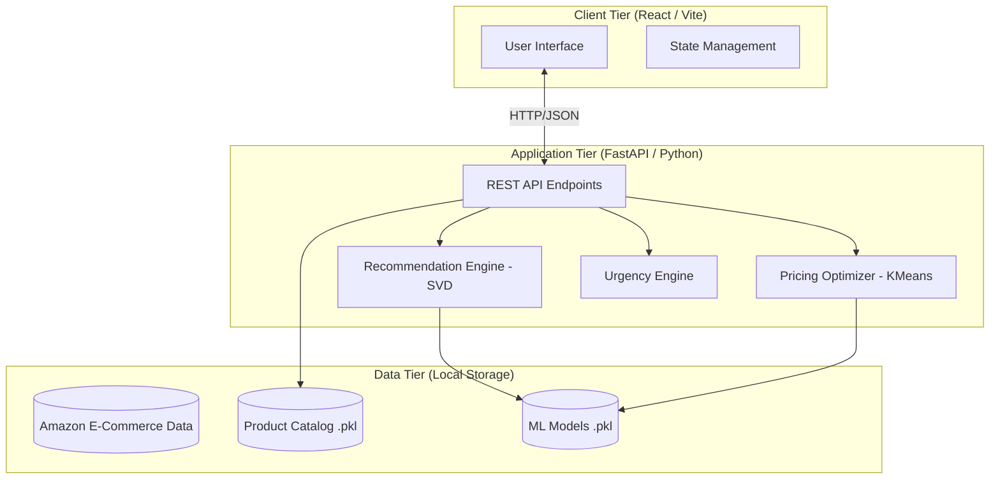

# Customer Segmentation with Conversion Engine (QUAD.AI)

An AI-powered, dynamic e-commerce conversion platform utilizing Machine Learning to personalize user experience in real-time. The application is built on a modern decoupled architecture featuring a **FastAPI backend** (running machine learning pipelines) and a **React (Vite) frontend** (for interactive shopper and seller interfaces).

---

## 🚀 Key Features

*   **Truncated SVD Recommendation Engine:** Uses Collaborative Filtering to generate personalized product recommendations based on user-item interaction histories.
*   **K-Means Price Optimizer:** Segments users into distinct price-sensitivity clusters based on historical discount utilization and optimizes discounts dynamically.
*   **Psychological Urgency Engine:** Employs rules-based behavioral heuristics (scarcity, popularity, and time-sensitive urgency nudges) tailored to the shopper's cluster.
*   **Seller Analytics Dashboard:** Provides administrators with interactive charts (revenue trends, return rates, pricing impact) powered by Chart.js.
*   **Customer Segmentation Profiler:** Displays analytical breakdowns of the K-Means clusters for administrative review.

---

## 📐 System Architecture

The project uses a decoupled Client-Server architecture where the frontend handles rendering and state, and the backend handles machine learning inference.



---

## 🛠️ Quick Start Guide

### Prerequisites
*   [Python 3.9+](https://www.python.org/)
*   [Node.js (v18+)](https://nodejs.org/) & `npm`

---

### Step 1: Backend Setup (FastAPI)

1. Navigate to the backend directory:
   ```bash
   cd ecommerce-conversion-engine
   ```

2. Activate the pre-configured virtual environment:
   *   **Windows (Command Prompt):**
       ```cmd
       venv\Scripts\activate.bat
       ```
   *   **Windows (PowerShell):**
       ```powershell
       .\venv\Scripts\Activate.ps1
       ```
   *   **macOS/Linux:**
       ```bash
       source venv/bin/activate
       ```

3. Install requirements (if not already done):
   ```bash
   pip install -r requirements.txt
   ```

4. Start the FastAPI server using Uvicorn:
   ```bash
   venv\Scripts\uvicorn.exe backend.main:app --host 0.0.0.0 --port 8000
   ```
   *The API will be live at `http://localhost:8000` (docs available at `http://localhost:8000/docs`).*

---

### Step 2: Frontend Setup (React + Vite)

1. Open a **new** terminal window and navigate to the frontend directory:
   ```bash
   cd ecommerce-conversion-engine/frontend
   ```

2. Start the development server (dependencies are pre-installed in `node_modules`):
   ```bash
   npm run dev
   ```
   *The application UI will open at `http://localhost:5173`.*

---

## 🔐 Administrative Access

To access the Admin views (Seller Dashboard and Customer Segments), click **"Admin Login"** in the sidebar of the application:

| Username | Password |
| :--- | :--- |
| `admin` | `Pravee9a` |

---

## 🧠 Machine Learning Engine Details

### 1. Price Sensitivity Clustering (K-Means)
The platform processes transaction data to classify users into behavioral cohorts:
*   **Cluster 0: Moderate Shoppers:** Average discount responders who prioritize value over raw price.
*   **Cluster 1: Price-Sensitive Deal Seekers:** High responsiveness to discounts; requires nudges and promotion offers to convert.
*   **Cluster 2: Premium Buyers:** Low discount sensitivity; prioritizes product ratings and premium brands.

### 2. Collaborative Filtering (Truncated SVD)
The recommendation model decomposes user-item interactions into 12 latent features. This allows the system to predict potential interest in items the user has not yet seen, solving the cold-start problem using category-popularity fallbacks.

---

## ⚠️ Troubleshooting

| Issue | Solution |
| :--- | :--- |
| **`preprocess.py` fails** | Make sure your raw dataset `amazon_ecommerce_1M.csv` is present in the root folder. |
| **Models fail to load in the UI** | Verify the FastAPI server is running on port `8000` simultaneously. |
| **`uvicorn` command not found** | Ensure the Python virtual environment (`venv`) is activated. |
